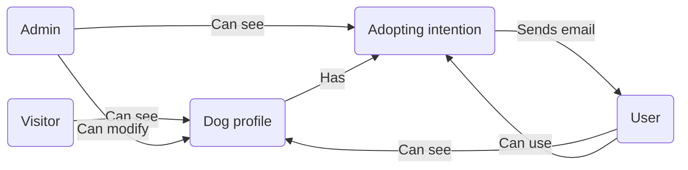
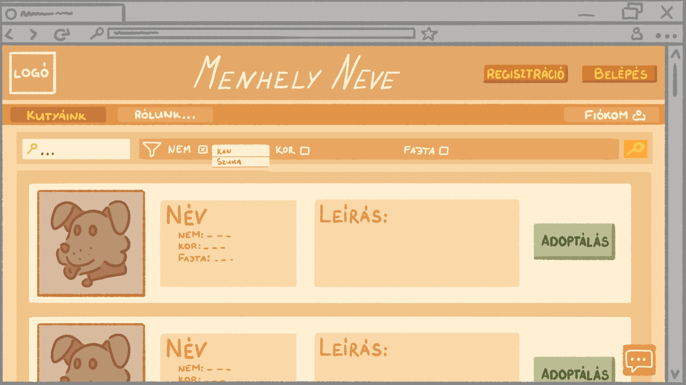
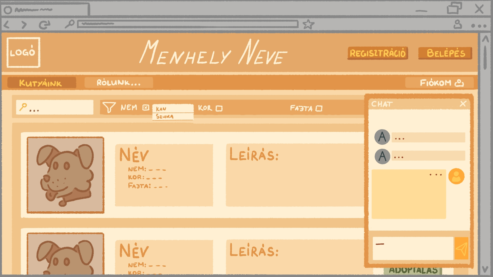

# Funkcionális specifikáció

---

## Tartalomjegyzék:

1. [Jelenlegi helyzet leírása](#1-jelenlegi-helyzet-leírása)

2. [Vágyálomrendszer leírása](#2-vágyálomrendszer-leírása)

3. [Megfeleltetés a jogi szabályoknak](#3-megfeleltetés-a-jogi-szabályoknak)

4. [Jelenlegi üzleti folyamatok modellje](#4-jelenlegi-üzleti-folyamatok-modellje)

5. [Igényelt üzleti folyamatok modellje](#5-igényelt-üzleti-folyamatok-modellje)

6. [Követelménylista](#6-követelménylista)

7. [Használati esetek](#7-használati-esetek)

8. [Képernyőtervek](#8-képernyőtervek)

9. [Forgatókönyvek](#9-forgatókönyvek)

---

## 1. Jelenlegi helyzet leírása

Jelenleg a menhely rendelkezik egy egyszerű weboldallal, amely lehetőséget biztosít a regisztrációra e-mail cím megadása és validálása mellett. A weboldalon a látogatók böngészhetik a menhely által feltöltött kutyák listáját. Minden egyes kutya profilján megjelennek az alábbi adatok: név, kor, nem, adoptálhatósági státusz, egy rövid leírás, valamint egy profilkép az adott kutyáról.

A regisztráció után a felhasználók be tudnak jelentkezni a rendszerbe, és ezt követően lehetőségük nyílik örökbefogadási kérelmet benyújtani az általuk kiválasztott kutyához. Az adminisztrátorok szintén be tudnak jelentkezni egy külön admin fiókba, ahol hozzáférhetnek a bejövő örökbefogadási kérelmekhez. Az adminisztrátori felület lehetőséget biztosít a kérelmek kezelésére: elfogadhatják vagy elutasíthatják azokat, támogatva ezzel az örökbefogadási folyamat gördülékeny lebonyolítását.

## 2. Vágyálomrendszer leírása

A jelenlegi webalkalmazást az alábbi funkciókkal tervezzük bővíteni:

### 2.1 Általános funkciók:

- Integrált chatfelület felhasználók és adminok közt, amely lebegő menüként oldalt megnyitható.
- Kétféle kutyaleírás létrehozása: egy rövidebb, amely a listázásnál látható, és egy részletesebb, amely a
  kutya profilján jelenik meg.
- Kutyák szűrése keresésnél kor, nem és fajta szerint.
- Reszponzív webdizájn létrehozása különböző eszközökön: mobil, tablet, számítógép.
- Több fénykép megjelenítése a kutya profilján.

### 2.2 Adminisztrátori funkciók:

- Több adminisztrátor jogosultsággal rendelkező felhasználó hozzáadása.
- Képek feltöltése a kutyák profiljához, kutya profiljában megjelenő kép kiválasztása.
- Felhasználók profiljainak menedzselése: regisztrált fiók törlése a rendszerből.

### 2.3 Felhasználói funkciók:

- Telefonszám megadása/módosítása a profilban.

## 3. Megfeleltetés a jogi szabályoknak

A weboldal a magyar GDPR-szabályoknak megfelelően csak akkor tárol telefonszámokat és e-mail címeket, ha azok gyűjtése
jogos célból történik, és a felhasználó ehhez kifejezetten hozzájárul. A GDPR előírásai szerint az ilyen adatok
személyes adatnak számítanak, és csak akkor gyűjthetők, ha egyértelműen szükségesek, például a felhasználó
megkereséséhez. A weboldal gondoskodik arról, hogy a felhasználók előre tájékozódjanak arról, hogyan használják fel az
adataikat, és gyűjtés előtt hozzájárulásukat adják. Az adatok biztonságát szigorú intézkedések garantálják, és a
felhasználóknak bármikor joguk van kérni az adataikhoz való hozzáférést, azok módosítását vagy törlését. Az adatok
tárolása a GDPR szabályai szerint történik, vagyis a már nem szükséges vagy elavult adatokat biztonságosan törlik.

Regisztrációhoz a GDPR-t el kell fogadni a regisztráció elfogadásához, a Követelményspecifikációban megaddott
Adatvédelmi Tájékoztató elolvasható egy külön ablakban.

## 4. Jelenlegi üzleti folyamatok modellje

A menhely jelenlegi weboldalán az üzleti folyamatok az alábbiak szerint épülnek fel:

### 4.1 Folyamatok és funkciók:

- **Kutyaprofilok böngészése:** A weboldalon minden látogató megtekintheti a menhely által feltöltött kutyák profilját,
  amely tartalmazza a kutyák alapadatait, leírását és egy profilképet. A látogatóknak nincs szükségük személyes
  megtekintésre, mivel minden lényeges információ megtalálható online.

- **Örökbefogadási szándék jelzése:** Bejelentkezett felhasználók képesek örökbefogadási szándékukat jelezni a kiszemelt
  kutya profilján keresztül. A kutyaprofilon ezután feltüntetésre kerül, hogy az adott kutya iránt már érdeklődnek. Az
  örökbefogadást végső soron a menhely dolgozói személyesen tisztázzák, mely után a kutya profilja eltávolításra kerül a
  weboldalról.

- **Kapcsolattartás:** A menhely dolgozói elérhetők e-mailen keresztül, és ezen kapcsolatfelvételi adat könnyen
  megtalálható a weboldalon.

- **Regisztráció és belépés:** A látogatók egy e-mail validáció után regisztrálhatnak a weboldalra. A regisztrációt
  követően bejelentkezhetnek a rendszerbe, és hozzáférhetnek a felhasználói funkciókhoz, például az örökbefogadási igény
  jelzéséhez.

- **Adminisztrációs folyamatok**: Az adminisztrátorok bejelentkezhetnek a rendszerbe, ahol hozzáférést kapnak a beérkező
  örökbefogadási kérelmekhez, és ezek alapján dönthetnek a kérelmek elfogadásáról vagy elutasításáról.

## 5. Igényelt üzleti folyamatok modellje

## 6. Követelménylista

## 7. Használati esetek

## 8. Képernyőtervek

### 8.1 Teljes weboldal:

Grafikus terveket lásd itt: [8.5 Mellékéet](#85-mellékklet)

A Chat megjelenítése minden aloldara vonatkozik. Számítógépen egy aloldalra való átlépéskor a chat nyitott állapotban
marad, egészen addig, amíg be nem zárjuk.

- **"Chat" gomb:** A jobb alsó gomb segítségével megnyitható a chat funkció.

### 8.2. "Kutyáink" menüpont:

Grafikus terveket lásd itt: [8.5 Mellékéet](#85-mellékklet)

Az oldal tetejéhez egy új fejléc kerül hozzáadásra, amely lehetővé teszi a kutyák közti keresést.

- **Szabad szavas keresőmező:** Lehetővé teszi a kulcsszavas keresést. Kereső funkció amely a kutya nevét és leírását
  vizsgálja.
- **Szűrés funkció:** A szűrést szeretnénk kor, nem és fajta alapján végrehajtani. Ha a checkbox-ot bepipáljuk,
  megjelenik egy legördülő menü, amelyben szereplenek azok a kifejezések, amelyekre szűrhetjük a találatot.
- **"Keresés" gomb:** Megnyomásával újratöltődnek a kutyák az adatbázisból, és a keresésnek/szűrésnek megfelelő
  eredmények
  jelennek meg.

### 8.3. Kutyaprofil:

- A kutya saját profilján egy részletesebb leírás jelenik meg.
- A kutyához tartozó többi kép itt jelenik meg.

#### 8.3.1 Adminisztrátori nézet:

- **"Új kép feltöltése" gomb:** Lehetővé teszi az új képek feltöltését.
- Képeket a "Szerkesztés" gombra kattintva is fel tudunk tölteni, itt állíthatjuk be a kutya elsődleges profilképét.

### 8.4. "Fiókom" menüpont:

#### 8.4.1 Felhasználói nézet:

Az oldalon mostmár látható a fiókhoz eltárolt telefonszám.

- **"Telefonszám szerkesztése" gomb:** Lehetővé teszi, hogy a telefonszám szerkeszthető legyen.

#### 8.4.2 Adminisztrátori nézet:

Megjelenik egy új szekció: **Felhasználók**. A regisztrált felhasználók e-mail cím és telefonszám párosítása itt jelenik meg.
- **"Felhasználó törlése" gomb:** Törli a felhasználó adatait és regisztrációját.

#### 8.5 Mellékklet:

## 9. Forgatókönyvek
