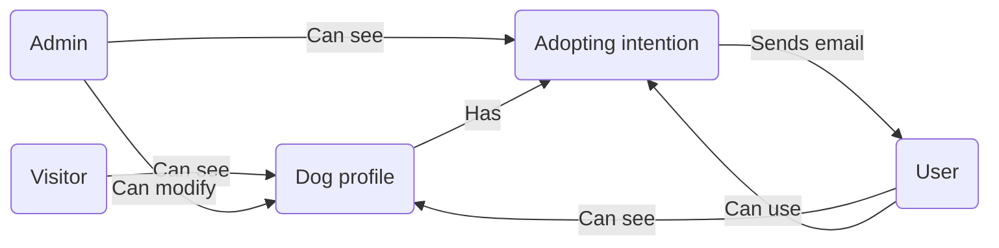

# Funkcionális specifikáció

---

## Tartalomjegyzék:

1. [Jelenlegi helyzet leírása](#1-jelenlegi-helyzet-leírása)

2. [Vágyálomrendszer leírása](#2-vágyálomrendszer-leírása)

3. [Megfeleltetés a jogi szabályoknak](#3-megfeleltetés-a-jogi-szabályoknak)

4. [Jelenlegi üzleti folyamatok modellje](#4-jelenlegi-üzleti-folyamatok-modellje)

5. [Igényelt üzleti folyamatok modellje](#5-igényelt-üzleti-folyamatok-modellje)

6. [Követelménylista](#6-követelménylista)

7. [Használati esetek](#7-használati-esetek)

8. [Képernyőtervek](#8-képernyőtervek)

9. [Forgatókönyvek](#9-forgatókönyvek)

---

## 1. Jelenlegi helyzet leírása

Jelenleg a menhely rendelkezik egy egyszerű weboldallal, amely lehetőséget biztosít a regisztrációra e-mail cím megadása és validálása mellett. A weboldalon a látogatók böngészhetik a menhely által feltöltött kutyák listáját. Minden egyes kutya profilján megjelennek az alábbi adatok: név, kor, nem, adoptálhatósági státusz, egy rövid leírás, valamint egy profilkép az adott kutyáról.

A regisztráció után a felhasználók be tudnak jelentkezni a rendszerbe, és ezt követően lehetőségük nyílik örökbefogadási kérelmet benyújtani az általuk kiválasztott kutyához. Az adminisztrátorok szintén be tudnak jelentkezni egy külön admin fiókba, ahol hozzáférhetnek a bejövő örökbefogadási kérelmekhez. Az adminisztrátori felület lehetőséget biztosít a kérelmek kezelésére: elfogadhatják vagy elutasíthatják azokat, támogatva ezzel az örökbefogadási folyamat gördülékeny lebonyolítását.

## 2. Vágyálomrendszer leírása

A jelenlegi webalkalmazást az alábbi funkciókkal tervezzük bővíteni:

### 2.1 Általános funkciók:

- Integrált chatfelület felhasználók és adminok közt, amely lebegő menüként oldalt megnyitható.
- Kétféle kutyaleírás létrehozása: egy rövidebb, amely a listázásnál látható, és egy részletesebb, amely a
  kutya profilján jelenik meg.
- Kutyák szűrése keresésnél kor, nem és fajta szerint.
- Reszponzív webdizájn létrehozása különböző eszközökön: mobil, tablet, számítógép.
- Több fénykép megjelenítése a kutya profilján.

### 2.2 Adminisztrátori funkciók:

- Több adminisztrátor jogosultsággal rendelkező felhasználó hozzáadása.
- Képek feltöltése a kutyák profiljához, kutya profiljában megjelenő kép kiválasztása.
- Felhasználók profiljainak menedzselése: regisztrált fiók törlése a rendszerből.

### 2.3 Felhasználói funkciók:

- Telefonszám megadása/módosítása a profilban.

## 3. Megfeleltetés a jogi szabályoknak

A weboldal a magyar GDPR-szabályoknak megfelelően csak akkor tárol telefonszámokat és e-mail címeket, ha azok gyűjtése
jogos célból történik, és a felhasználó ehhez kifejezetten hozzájárul. A GDPR előírásai szerint az ilyen adatok
személyes adatnak számítanak, és csak akkor gyűjthetők, ha egyértelműen szükségesek, például a felhasználó
megkereséséhez. A weboldal gondoskodik arról, hogy a felhasználók előre tájékozódjanak arról, hogyan használják fel az
adataikat, és gyűjtés előtt hozzájárulásukat adják. Az adatok biztonságát szigorú intézkedések garantálják, és a
felhasználóknak bármikor joguk van kérni az adataikhoz való hozzáférést, azok módosítását vagy törlését. Az adatok
tárolása a GDPR szabályai szerint történik, vagyis a már nem szükséges vagy elavult adatokat biztonságosan törlik.

Regisztrációhoz a GDPR-t el kell fogadni a regisztráció elfogadásához, a Követelményspecifikációban megaddott
Adatvédelmi Tájékoztató elolvasható egy külön ablakban.

```
Ez az adatvédelmi tájékoztató egy egyetemi projekt részeként készült, és nem szolgál valós célokat. 
Csupán egy Mesterséges Intelligencia segítségével generált minta.

Adatvédelmi Tájékoztató

1. Bevezetés
A Lakatos Brendon Menhelye elkötelezett az Ön személyes adatainak védelme mellett. 
Az adatvédelmi tájékoztató célja, hogy részletesen bemutassa, hogyan gyűjtjük, használjuk és védjük az Ön személyes 
adatait, valamint hogy ismertessük az Ön jogait a GDPR (Általános Adatvédelmi Rendelet) alapján.

2. Az általunk gyűjtött adatok
A weboldal használata során a következő személyes adatokat gyűjtjük:

Telefonszám
E-mail cím

3. Adatgyűjtés célja
Személyes adatait az alábbi célokra gyűjtjük és használjuk fel:

Az Ön kérdéseinek és megkereséseinek megválaszolása
Adatainak nyilvántartása az örökbefogadási kérelem kezelése érdekében (ha alkalmazható)
Jogszabályi kötelezettségek teljesítése

4. Az adatkezelés jogalapja
Az Ön személyes adatait kizárólag az alábbi jogalapok alapján kezeljük:

Az Ön hozzájárulása (például regisztráció esetén)
Szerződés teljesítése (például örökbefogadási folyamat során)
Jogos érdekek (például a weboldal működtetése és karbantartása)

5. Adattovábbítás és megosztás
Az Ön személyes adatait harmadik féllel csak az alábbi esetekben osztjuk meg:

Amennyiben az adattovábbítás jogszabályi kötelezettségből ered
Harmadik feleknek, akik a nevünkben végzik az adatfeldolgozást (például IT szolgáltatók)

6. Adatmegőrzési időszak
Az Ön személyes adatait csak addig őrizzük meg, amíg az az adatkezelés céljának eléréséhez szükséges, vagy amíg az Ön 
hozzájárulása érvényben van. A felesleges vagy elavult adatokat biztonságosan töröljük.

7. Az Ön jogai
Az Ön GDPR szerinti jogai a következők:

Hozzáférési jog: Jogában áll tudni, hogy milyen adatokat tárolunk Önről.
Helyesbítési jog: Kérheti adatai módosítását vagy javítását.
Törlési jog: Kérheti személyes adatainak törlését ("elfeledtetéshez való jog").
Adatkezelés korlátozása: Kérheti adatainak kezelésének korlátozását bizonyos esetekben.
Adathordozhatósághoz való jog: Kérheti adatai másik szolgáltatóhoz való továbbítását.
Hozzájárulás visszavonása: Bármikor visszavonhatja a hozzájárulását, ha az adatkezelés jogalapja a hozzájárulás.

8. Biztonsági intézkedések
Minden szükséges technikai és szervezési intézkedést megteszünk annak érdekében, hogy személyes adatait védelemmel 
lássuk el, és megakadályozzuk az adatokhoz való illetéktelen hozzáférést, azok elvesztését vagy jogosulatlan felhasználását.

9. Kapcsolatfelvétel
Amennyiben kérdése vagy kérése van az adatvédelmi szabályzatunkkal kapcsolatban, vagy gyakorolni szeretné a GDPR 
szerinti jogait, kérjük, vegye fel velünk a kapcsolatot az alábbi elérhetőségeken:

Lakatos Brendon Menhelye
1234 Budapest, Kutyus utca 5.
+36 30 123 4567
info@inabiaf.org

10. Panasz benyújtása
Ha úgy érzi, hogy személyes adatait nem megfelelően kezeljük, panaszt tehet a helyi adatvédelmi hatóságnál:

Nemzeti Adatvédelmi és Információszabadság Hatóság (NAIH) https://www.naih.hu

11. A szabályzat módosítása
Fenntartjuk a jogot, hogy ezt az adatvédelmi tájékoztatót időről időre frissítsük. Az esetleges változásokat itt 
tesszük közzé, így kérjük, látogasson vissza rendszeresen.

Utolsó módosítás dátuma: 2024.10.12
```

## 4. Jelenlegi üzleti folyamatok modellje

A menhely jelenlegi weboldalán az üzleti folyamatok az alábbiak szerint épülnek fel:



### 4.1 Folyamatok és funkciók:

- **Kutyaprofilok böngészése:** A weboldalon minden látogató megtekintheti a menhely által feltöltött kutyák profilját,
  amely tartalmazza a kutyák alapadatait, leírását és egy profilképet. A látogatóknak nincs szükségük személyes
  megtekintésre, mivel minden lényeges információ megtalálható online.


- **Örökbefogadási szándék jelzése:** Bejelentkezett felhasználók képesek örökbefogadási szándékukat jelezni a kiszemelt
  kutya profilján keresztül. A kutyaprofilon ezután feltüntetésre kerül, hogy az adott kutya iránt már érdeklődnek. Az
  örökbefogadást végső soron a menhely dolgozói személyesen tisztázzák, mely után a kutya profilja eltávolításra kerül a
  weboldalról.


- **Kapcsolattartás:** A menhely dolgozói elérhetők e-mailen keresztül, és ezen kapcsolatfelvételi adat könnyen
  megtalálható a weboldalon.


- **Regisztráció és belépés:** A látogatók egy e-mail validáció után regisztrálhatnak a weboldalra. A regisztrációt
  követően bejelentkezhetnek a rendszerbe, és hozzáférhetnek a felhasználói funkciókhoz, például az örökbefogadási igény
  jelzéséhez.


- **Adminisztrációs folyamatok**: Az adminisztrátorok bejelentkezhetnek a rendszerbe, ahol hozzáférést kapnak a beérkező
  örökbefogadási kérelmekhez, és ezek alapján dönthetnek a kérelmek elfogadásáról vagy elutasításáról.

## 5. Igényelt üzleti folyamatok modellje

Az igényelt üzleti folyamatok modellje biztosítja, hogy a weboldal modern és felhasználóbarát legyen, valamint
egyszerűbb és hatékonyabb örökbefogadási folyamatot tegyen lehetővé a menhely számára. Az igényelt folyamatok a
következőket tartalmazzák:

### 5.1 Több adminisztrátor hozzáférés
Az adminisztrátori hozzáférés több menhelyi dolgozó számára biztosít lehetőséget a kutyaprofilok kezelésére és az örökbefogadási kérelmek adminisztrálására. Az adminok így hatékonyabban kezelhetik az adatokat, lehetőségük van profilokat létrehozni, módosítani és az érkező kérelmeket elfogadni vagy elutasítani.

### 5.2 Képfeltöltési funkció
Az új funkció lehetővé teszi a kutyaprofilokhoz több fénykép feltöltését, amely különböző nézőpontokból mutatja be a kutyákat. Ezáltal a látogatók részletesebb vizuális információk alapján dönthetnek, ami javítja az örökbefogadás esélyét.

### 5.3 Integrált chatfelület
Az integrált, valós idejű chatfelület a felhasználók és adminisztrátorok közötti kommunikációt egyszerűsíti. A chatben a felhasználók azonnal választ kaphatnak kérdéseikre, ami gyorsítja az örökbefogadási folyamatot és növeli az elégedettséget.

### 5.4 Adatmódosítás a felhasználók számára
A regisztrált felhasználók frissíthetik saját adataikat, beleértve a telefonszámukat is. Ez biztosítja, hogy az adminok naprakész elérhetőséggel rendelkezzenek, és így könnyebben tudjanak kapcsolatot tartani a potenciális örökbefogadókkal.

### 5.5 Részletesebb profilok és szűrési lehetőségek
A kutyaprofilok kétféle leírással rendelkeznek: egy rövid, amely a listában látható, és egy részletes, amely a kutya profilján jelenik meg. Továbbá, a kutyák szűrhetők kor, nem és fajta szerint, így a felhasználók gyorsabban és egyszerűbben megtalálhatják az igényeiknek megfelelő állatot.

## 6. Követelménylista

| Modul         | ID  | Név                              | Leírás                                                                                                             |
|---------------|-----|----------------------------------|--------------------------------------------------------------------------------------------------------------------|
| Jogosultság   | P1  | Adminisztrátor hozzáadása        | A rendszerben több adminisztrátori jogosultságú felhasználó legyen létrehozható.                                   |
| Jogosultság   | P2  | Telefonszám frissítése           | A regisztrált felhasználók bármikor frissíthetik a saját profiljukon megadott telefonszámukat.                     |
| Jogosultság   | P3  | Felhasználói fiók törlése        | Az adminisztrátorok törölhetik a felhasználói fiókokat szükség esetén.                                             |
| Kutya         | D1  | Kutyaprofil képfeltöltés         | Az adminisztrátorok képesek legyenek több képet feltölteni az egyes kutyaprofilokhoz, és kiválasztani egy profilképet. |
| Kutya         | D2  | Rövid és részletes leírás        | Minden kutyaprofil kétféle leírással rendelkezzen: egy rövid leírással a listázáshoz és egy részletes leírással a profiloldalon. |
| Kutya         | D3  | Szűrési funkció                  | A felhasználók a kutyákat kor, fajta és nem szerint szűrhetik a megfelelő kutya könnyebb megtalálása érdekében.    |
| Interakció    | I1  | Beépített chat                    | A felhasználók és adminisztrátorok valós idejű üzenetküldő felületen keresztül kommunikálhatnak az örökbefogadási folyamat során. |
| Megjelenítés  | M1  | Reszponzív webdizájn             | A weboldal reszponzív legyen, biztosítva a megfelelő megjelenést és használhatóságot minden eszközön.             |

## 7. Használati esetek

### 7.1 Felhasználók

A weboldal felhasználói számára a következő új lehetőség áll rendelkezésre:

**Telefonszám frissítése:**
A regisztrált felhasználók bármikor módosíthatják saját telefonszámukat a profiljukon keresztül, ha esetleg korábbi
telefonszáma megszűnt. Ha nincs megadva telefonszám, itt rendelheti hozzá fiókjához.

### 7.2 Adminisztrátorok

Az adminisztráltorok számára a következő új funkciók állnak rendelkezésre:

**Felhasználói profilok kezelése:** Az adminok képesek megtekinteni a regisztrált felhasználók listáját, és szükség
esetén törölni azokat.
**Új adminisztrátor hozzáadása a regisztrált felhasználók közül:** A rendszerben több adminisztrátori jogkörű
felhasználó legyen létrehozható. A korábban regisztrált felhasználókhoz rendelhető hozzá az adminisztrátori jogosultság.
**Kutya képek feltöltése:** Az adminisztrátorok képesek képeket feltölteni az egyes kutyákhoz, és kiválasztani egy
profilképet. Ez lehetséges új kutya feltötlésekor és a kutya adatainak szerkesztésekor is.

### 7.3 Kutya Profilok

A kutyák profiljai az adminisztrátorok által létrehozott adatok tárolására szolgálnak, és a következő új funkciókat
biztosítják:

**Rövid és hosszú leírás használata:** Minden kutyaprofilnál kétféle leírás legyen elérhető: egy rövidebb a listázáshoz
és egy részletesebb a profiloldalon.
**Egyedi profilkép, képek megjelenítése:** Most már a kutyák listázásakor minden kutya esetén egyedi profilkép jelenik
meg, a részletes adatoknál pedig megtekinthetők a további képek a kutyákról.
**Szűrési lehetőség:** A kutyákat listázáskor szűrni lehet kor, fajta és nem szerint, a könnyeb keresés érdekében.

### 7.4 Chat funkció

A weboldalon beépített chatfelület áll rendelkezésre a felhasználók és adminisztrátorok között, amely a következő
lehetőségeket kínálja:

Valós idejű kommunikáció: A felhasználók és adminisztrátorok valós időben, üzenetek küldésével kommunikálhatnak
egymással.
Kérdések és válaszok: Az adminisztrátorok gyorsan válaszolhatnak a felhasználók kérdéseire az örökbefogadási folyamat
során, javítva ezzel a felhasználói élményt

## 8. Képernyőtervek

### 8.1 Teljes weboldal:

Grafikus terveket lásd itt: [8.5 Mellékéet](#85-mellékklet)

A Chat megjelenítése minden aloldara vonatkozik. Számítógépen egy aloldalra való átlépéskor a chat nyitott állapotban
marad, egészen addig, amíg be nem zárjuk.

- **"Chat" gomb:** A jobb alsó gomb segítségével megnyitható a chat funkció.

### 8.2. "Kutyáink" menüpont:

Grafikus terveket lásd itt: [8.5 Mellékéet](#85-mellékklet)

Az oldal tetejéhez egy új fejléc kerül hozzáadásra, amely lehetővé teszi a kutyák közti keresést.

- **Szabad szavas keresőmező:** Lehetővé teszi a kulcsszavas keresést. Kereső funkció amely a kutya nevét és leírását
  vizsgálja.
- **Szűrés funkció:** A szűrést szeretnénk kor, nem és fajta alapján végrehajtani. Ha a checkbox-ot bepipáljuk,
  megjelenik egy legördülő menü, amelyben szereplenek azok a kifejezések, amelyekre szűrhetjük a találatot.
- **"Keresés" gomb:** Megnyomásával újratöltődnek a kutyák az adatbázisból, és a keresésnek/szűrésnek megfelelő
  eredmények
  jelennek meg.

### 8.3. Kutyaprofil:

- A kutya saját profilján egy részletesebb leírás jelenik meg.
- A kutyához tartozó többi kép itt jelenik meg.

#### 8.3.1 Adminisztrátori nézet:

- **"Új kép feltöltése" gomb:** Lehetővé teszi az új képek feltöltését.
- Képeket a "Szerkesztés" gombra kattintva is fel tudunk tölteni, itt állíthatjuk be a kutya elsődleges profilképét.

### 8.4. "Fiókom" menüpont:

#### 8.4.1 Felhasználói nézet:

Az oldalon mostmár látható a fiókhoz eltárolt telefonszám.

- **"Telefonszám szerkesztése" gomb:** Lehetővé teszi, hogy a telefonszám szerkeszthető legyen.

#### 8.4.2 Adminisztrátori nézet:

Megjelenik egy új szekció: **Felhasználók**. A regisztrált felhasználók e-mail cím és telefonszám párosítása itt jelenik meg.
- **"Felhasználó törlése" gomb:** Törli a felhasználó adatait és regisztrációját.

#### 8.5 Mellékklet:


## 9. Forgatókönyvek

### 9.1 Kutya örökbefogadási kérelem beküldése
**Leírás:** A felhasználó megnyitja a "Kutyáink" oldalt, kiválaszt egy kutyát, majd a kutya profilján megjelenő "
Örökbefogadási kérelem" gombra kattintva beküldi igényét.

**Szereplők:** Felhasználó, Rendszer, Adminisztrátor

**Előfeltételek:** A felhasználó bejelentkezett, és a kiválasztott kutya profilja elérhető.

**Lépések:**
1. A felhasználó rákattint a "Kutyáink" menüpontra.
2. A felhasználó kiválaszt egy kutyát a listáról.
3. A kutya profilján a felhasználó megnyomja az "Örökbefogadási kérelem" gombot.
4. A rendszer értesíti az adminisztrátort az új örökbefogadási igényről.
5. A felhasználó e-mailben értesítést kap az igény fogadásáról és a következő lépésekről.

**Következmény:** Az örökbefogadási kérelem rögzítésre kerül, és megjelenik az adminisztrátori nézetben.

### 9.2 Kép feltöltése egy kutya profiljához (adminisztrátor)
**Leírás:** Az adminisztrátor bejelentkezik, megkeresi a kiválasztott kutya profilját, és új képet tölt fel hozzá.

**Szereplők:** Adminisztrátor, Rendszer

**Előfeltételek:** Az adminisztrátor bejelentkezett a rendszerbe.

**Lépések:**
1. Az adminisztrátor a főmenüből a kutyák kezeléséhez navigál.
2. Megnyitja a feltölteni kívánt kutya profilját.
3. A "Kép feltöltése" gombra kattintva kiválasztja a feltölteni kívánt fájlt.
4. A rendszer a feltöltött képet megjeleníti a kutya profiljában.

**Következmény:** Az új kép megjelenik a kutya profilján.

### 9.3 Felhasználói profil törlése (adminisztrátor)
**Leírás:** Az adminisztrátor bejelentkezik, megnyitja a "Felhasználók" menüpontot, és töröl egy felhasználói profilt.

**Szereplők:** Adminisztrátor, Rendszer

**Előfeltételek:** Az adminisztrátor bejelentkezett, és hozzáfér a "Felhasználók" menüponthoz.

**Lépések:**
1. Az adminisztrátor megnyitja a "Felhasználók" menüpontot.
2. A törölni kívánt felhasználó mellett található "Törlés" gombra kattint.
3. A rendszer megjelenít egy megerősítő ablakot, ahol az adminisztrátor véglegesíti a törlést.
4. A felhasználói profil törlődik a rendszerből.

**Következmény:** A felhasználói profil nem jelenik meg többé a rendszerben, és minden hozzá tartozó adat törlésre
kerül.