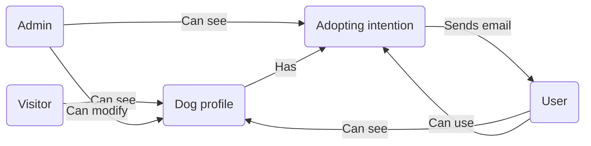

# Követelményspecifikáció

---

## Tartalomjegyzék:

1. [Jelenlegi helyzet leírása](#1-jelenlegi-helyzet-leírása)

2. [Vágyálomrendszer leírása](#2-vágyálomrendszer-leírása)

3. [Megfeleltetés a jogi szabályoknak](#3-megfeleltetés-a-jogi-szabályoknak)

4. [Jelenlegi üzleti folyamatok modellje](#4-jelenlegi-üzleti-folyamatok-modellje)

5. [Igényelt üzleti folyamatok modellje](#5-igényelt-üzleti-folyamatok-modellje)

6. [Követelménylista](#6-követelménylista)

---

## 1. Jelenlegi helyzet leírása

Jelenleg a menhelynek egy egyszerű weboldal áll a rendelkezésére, amelyen e-mail cím megadása illetve validálása során
regisztrálni lehet. A weboldalon a feltöltött kutyák listáját böngészni lehet. Minden feltöltött kutya profilon
megjelenik azon kutya neve, kora, neme, adoptálhatósága, illetve egy rövid leírás az adott kutyáról, valamint egy "
profilkép" az adott kutyáról. Regisztráció után a rendszerbe való bejelentekzést követően lehet az adoptálható kutyák
közül választva örökbefogadási kérelmet benyújtani az adott kutyához. Az admin fiókba való bejelnetkezést követően a
bejövő kérelmeket lehet manipulálni, elfogadni illetve elutasítani.

## 2. Vágyálomrendszer leírása

Szeretnénk, hogy a webalkalmazás több adminisztrátori jogkörű felhasználó hozzáadását is lehetővé tegye. Fontos
számunkra, hogy az adminisztrátorok képeket is feltölthessenek a kutyák profiljaihoz. Szeretnénk egy integrált
chatfelületet biztosítani, amelyen keresztül az adminisztrátorok és felhasználók kommunikálhatnak, és amely könnyen
megnyitható. Emellett szükséges, hogy a felhasználók módosíthassák saját telefonszámukat, és az adminisztrátoroknak
legyen lehetőségük felhasználói regisztrációk törlésére.

A kutyaleírásokat kétféle módon képzeljük el: egy rövidebb, amely a listázásnál látható, és egy részletesebb, amely a
kutya profilján jelenik meg. Fontos, hogy a kutyákat szűrni lehessen kor, fajta és nem szerint, valamint biztosítani
szeretnénk a weboldal reszponzív megjelenését különböző eszközökön.

Ez a rendszer egyszerűsítené és hatékonyabbá tenné a menhely és az örökbefogadók közötti interakciókat, valamint
javítaná az örökbefogadási folyamat digitalizálását.

## 3. Megfeleltetés a jogi szabályoknak

A weboldal a magyar GDPR-szabályoknak megfelelően csak akkor tárol telefonszámokat és e-mail címeket, ha azok gyűjtése
jogos célból történik, és a felhasználó ehhez kifejezetten hozzájárul. A GDPR előírásai szerint az ilyen adatok
személyes adatnak számítanak, és csak akkor gyűjthetők, ha egyértelműen szükségesek, például a felhasználó
megkereséséhez. A weboldal gondoskodik arról, hogy a felhasználók előre tájékozódjanak arról, hogyan használják fel az
adataikat, és gyűjtés előtt hozzájárulásukat adják. Az adatok biztonságát szigorú intézkedések garantálják, és a
felhasználóknak bármikor joguk van kérni az adataikhoz való hozzáférést, azok módosítását vagy törlését. Az adatok
tárolása a GDPR szabályai szerint történik, vagyis a már nem szükséges vagy elavult adatokat biztonságosan törlik.

```
Ez az adatvédelmi tájékoztató egy egyetemi projekt részeként készült, és nem szolgál valós célokat. 
Csupán egy Mesterséges Intelligencia segítségével generált minta.

Adatvédelmi Tájékoztató

1. Bevezetés
A Lakatos Brendon Menhelye elkötelezett az Ön személyes adatainak védelme mellett. 
Az adatvédelmi tájékoztató célja, hogy részletesen bemutassa, hogyan gyűjtjük, használjuk és védjük az Ön személyes 
adatait, valamint hogy ismertessük az Ön jogait a GDPR (Általános Adatvédelmi Rendelet) alapján.

2. Az általunk gyűjtött adatok
A weboldal használata során a következő személyes adatokat gyűjtjük:

Telefonszám
E-mail cím

3. Adatgyűjtés célja
Személyes adatait az alábbi célokra gyűjtjük és használjuk fel:

Az Ön kérdéseinek és megkereséseinek megválaszolása
Adatainak nyilvántartása az örökbefogadási kérelem kezelése érdekében (ha alkalmazható)
Jogszabályi kötelezettségek teljesítése

4. Az adatkezelés jogalapja
Az Ön személyes adatait kizárólag az alábbi jogalapok alapján kezeljük:

Az Ön hozzájárulása (például regisztráció esetén)
Szerződés teljesítése (például örökbefogadási folyamat során)
Jogos érdekek (például a weboldal működtetése és karbantartása)

5. Adattovábbítás és megosztás
Az Ön személyes adatait harmadik féllel csak az alábbi esetekben osztjuk meg:

Amennyiben az adattovábbítás jogszabályi kötelezettségből ered
Harmadik feleknek, akik a nevünkben végzik az adatfeldolgozást (például IT szolgáltatók)

6. Adatmegőrzési időszak
Az Ön személyes adatait csak addig őrizzük meg, amíg az az adatkezelés céljának eléréséhez szükséges, vagy amíg az Ön 
hozzájárulása érvényben van. A felesleges vagy elavult adatokat biztonságosan töröljük.

7. Az Ön jogai
Az Ön GDPR szerinti jogai a következők:

Hozzáférési jog: Jogában áll tudni, hogy milyen adatokat tárolunk Önről.
Helyesbítési jog: Kérheti adatai módosítását vagy javítását.
Törlési jog: Kérheti személyes adatainak törlését ("elfeledtetéshez való jog").
Adatkezelés korlátozása: Kérheti adatainak kezelésének korlátozását bizonyos esetekben.
Adathordozhatósághoz való jog: Kérheti adatai másik szolgáltatóhoz való továbbítását.
Hozzájárulás visszavonása: Bármikor visszavonhatja a hozzájárulását, ha az adatkezelés jogalapja a hozzájárulás.

8. Biztonsági intézkedések
Minden szükséges technikai és szervezési intézkedést megteszünk annak érdekében, hogy személyes adatait védelemmel 
lássuk el, és megakadályozzuk az adatokhoz való illetéktelen hozzáférést, azok elvesztését vagy jogosulatlan felhasználását.

9. Kapcsolatfelvétel
Amennyiben kérdése vagy kérése van az adatvédelmi szabályzatunkkal kapcsolatban, vagy gyakorolni szeretné a GDPR 
szerinti jogait, kérjük, vegye fel velünk a kapcsolatot az alábbi elérhetőségeken:

Lakatos Brendon Menhelye
1234 Budapest, Kutyus utca 5.
+36 30 123 4567
info@inabiaf.org

11. Panasz benyújtása
Ha úgy érzi, hogy személyes adatait nem megfelelően kezeljük, panaszt tehet a helyi adatvédelmi hatóságnál:

Nemzeti Adatvédelmi és Információszabadság Hatóság (NAIH) https://www.naih.hu

12. A szabályzat módosítása
Fenntartjuk a jogot, hogy ezt az adatvédelmi tájékoztatót időről időre frissítsük. Az esetleges változásokat itt 
tesszük közzé, így kérjük, látogasson vissza rendszeresen.

Utolsó módosítás dátuma: 2024.10.12
```

## 4. Jelenlegi üzleti folyamatok modellje



- A weboldalon minden kutyának az adatait és leírásai könnyen megtekinthetők, nincs szükség személyes megtekintésre.

- A menhely weboldalán található kutyákat a felhasználók jelezhetik, hogy szeretnék örökbefogadni. Más felhasználók
  láthatják, hogy egy kutyát már valaki örökbe szeretne fogadni. Biztonsági okokból a menhely gondozói személyesen
  tisztázzák az örökbefogadást, melyet követően a kutya lekerül a weboldalról.

- A menhely dolgozóival e-mailen keresztül lehet felvenni a kapcsolatot. A weboldalon ezen az adat könnyen megtalálható.

- A weboldal látógatói képesek egy e-mail validáció után regisztrálni a weboldalra. Bejelentkezni a regisztrált
  hitelesítő adatok birtokában be lehet jelentkezni a weboldalra. Az admin fiók segítségével a beérkező kérelmeket
  elfogadni, illetve elutasítani lehet.

## 5. Igényelt üzleti folyamatok modellje

Az igényelt üzleti folyamatok modellje biztosítja, hogy a weboldal modern és felhasználóbarát legyen, valamint
egyszerűbb és hatékonyabb örökbefogadási folyamatot tegyen lehetővé a menhely számára. Az igényelt folyamatok a
következőket tartalmazzák:

### 5.1 Több adminisztrátor hozzáférés:

A menhely több munkatársa számára biztosított adminisztrátori jogkör lehetővé teszi,
hogy különböző felhasználók kezeljék a kutyaprofilokat és a beérkező örökbefogadási kérelmeket. Az adminisztrátorok
képesek kutyaprofilokat létrehozni, módosítani és kérelmeket elfogadni vagy elutasítani.

### 5.2 Képfeltöltési funkció:

A kutyaprofilhoz több kép feltöltése lehetővé teszi a látogatóknak, hogy több szempontból is
megismerhessék a kutyákat, javítva az esélyt az örökbefogadásra.

### 5.3 Integrált chatfelület:

Egy beépített, valós idejű üzenetküldő felület lehetővé teszi a felhasználók és adminisztrátorok
közötti gyors és egyszerű kommunikációt, amely során az örökbefogadási folyamatokkal kapcsolatos kérdések és válaszok
gyorsan megoszthatók.

### 5.4 Adatmódosítás a felhasználók számára:

A regisztrált felhasználók bármikor frissíthetik saját adataikat, beleértve a
telefonszámukat, így az adminisztrátorok mindig naprakész információkkal rendelkeznek a felhasználókról.

### 5.5 Részletesebb profilok és szűrési lehetőségek:

Kétféle kutyaleírás állna rendelkezésre – egy rövidebb, amely a
listázásnál látható, és egy részletesebb, amely a kutya profilján jelenik meg. Emellett a kutyák szűrhetők kor, fajta és
nem szerint, hogy a felhasználók gyorsabban megtalálhassák a számukra megfelelő állatot.

## 6. Követelménylista

| Modul        | ID | Név                               | Kifejtés                                                                                                                |
|--------------|----|-----------------------------------|-------------------------------------------------------------------------------------------------------------------------|
| Jogosultság  | P1 | Adminisztrátor hozzáadása         | A rendszerben több adminisztrátori jogkörű felhasználó legyen létrehozható.                                             |
| Jogosultság  | P2 | Telefonszám frissítési lehetőség  | A regisztrált felhasználók bármikor módosíthatják saját telefonszámukat a profiljukon keresztül.                        |
| Jogosultság  | P3 | Felhasználói regisztráció törlése | Az adminisztrátorok képesek legyenek a felhasználói fiókok törlésére szükség esetén.                                    |
| Kutya        | D1 | Kutya képek feltöltése            | Az adminisztrátorok képesek legyenek képeket feltölteni az egyes kutyákhoz, és kiválasztani egy profilképet.            |
| Kutya        | D2 | Rövid és hosszú leírás használata | Minden kutyaprofilnál kétféle leírás legyen elérhető: egy rövidebb a listázáshoz és egy részletesebb a profiloldalon.   |
| Kutya        | D3 | Szűrési lehetőség                 | A kutyákat a felhasználók szűrni tudják kor, fajta és nem szerint, hogy könnyebben megtalálják a megfelelő kutyát.      |
| Interakció   | I1 | Beépített chatfelület             | A felhasználók és adminisztrátorok valós idejű üzenetküldő felületen kommunikálhatnak az örökbefogadási folyamat során. |
| Megjelenítés | M1 | Reszponzív dizájn                 | A weboldal reszponzív legyen, így minden eszközön jól megjelenik, és kényelmesen használható.                           |