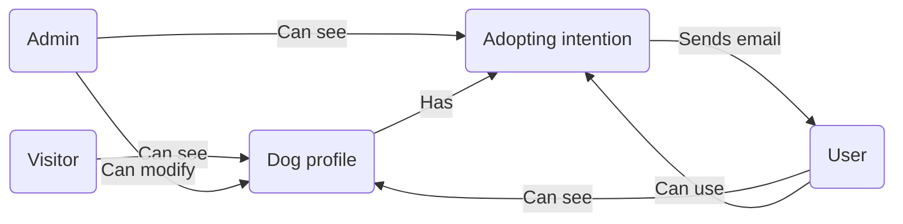

# Követelményspecifikáció

---

## Tartalomjegyzék:

1. [Jelenlegi helyzet leírása](#1-jelenlegi-helyzet-leírása)

2. [Vágyálomrendszer leírása](#2-vágyálomrendszer-leírása)

3. [Megfeleltetés a jogi szabályoknak](#3-megfeleltetés-a-jogi-szabályoknak)

4. [Jelenlegi üzleti folyamatok modellje](#4-jelenlegi-üzleti-folyamatok-modellje)

5. [Igényelt üzleti folyamatok modellje](#5-igényelt-üzleti-folyamatok-modellje)

6. [Követelménylista](#6-követelménylista)

---

## 1. Jelenlegi helyzet leírása

Jelenleg a menhelynek egy egyszerű weboldal áll a rendelkezésére, amelyen e-mail cím megadása illetve validálása során
regisztrálni lehet. A weboldalon a feltöltött kutyák listáját böngészni lehet. Minden feltöltött kutya profilon
megjelenik azon kutya neve, kora, neme, adoptálhatósága, illetve egy rövid leírás az adott kutyáról, valamint egy "
profilkép" az adott kutyáról. Regisztráció után a rendszerbe való bejelentekzést követően lehet az adoptálható kutyák
közül választva örökbefogadási kérelmet benyújtani az adott kutyához. Az admin fiókba való bejelnetkezést követően a
bejövő kérelmeket lehet manipulálni, elfogadni illetve elutasítani.

## 2. Vágyálomrendszer leírása

Szeretnénk, hogy a webalkalmazás több adminisztrátori jogkörű felhasználó hozzáadását is lehetővé tegye. Fontos
számunkra, hogy az adminisztrátorok képeket is feltölthessenek a kutyák profiljaihoz. Szeretnénk egy integrált
chatfelületet biztosítani, amelyen keresztül az adminisztrátorok és felhasználók kommunikálhatnak, és amely könnyen
megnyitható. Emellett szükséges, hogy a felhasználók módosíthassák saját telefonszámukat, és az adminisztrátoroknak
legyen lehetőségük felhasználói regisztrációk törlésére.

A kutyaleírásokat kétféle módon képzeljük el: egy rövidebb, amely a listázásnál látható, és egy részletesebb, amely a
kutya profilján jelenik meg. Fontos, hogy a kutyákat szűrni lehessen kor, fajta és nem szerint, valamint biztosítani
szeretnénk a weboldal reszponzív megjelenését különböző eszközökön.

Ez a rendszer egyszerűsítené és hatékonyabbá tenné a menhely és az örökbefogadók közötti interakciókat, valamint
javítaná az örökbefogadási folyamat digitalizálását.

## 3. Megfeleltetés a jogi szabályoknak

## 4. Jelenlegi üzleti folyamatok modellje

- A weboldalon minden kutyának az adatait és leírásai könnyen megtekinthetők, nincs szükség személyes megtekintésre.

- A menhely weboldalán található kutyákat a felhasználók jelezhetik, hogy szeretnék örökbefogadni. Más felhasználók
  láthatják, hogy egy kutyát már valaki örökbe szeretne fogadni. Biztonsági okokból a menhely gondozói személyesen
  tisztázzák az örökbefogadást, melyet követően a kutya lekerül a weboldalról.

- A menhely dolgozóival e-mailen keresztül lehet felvenni a kapcsolatot. A weboldalon ezen az adat könnyen megtalálható.

- A weboldal látógatói képesek egy e-mail validáció után regisztrálni a weboldalra. Bejelentkezni a regisztrált
  hitelesítő adatok birtokában be lehet jelentkezni a weboldalra. Az admin fiók segítségével a beérkező kérelmeket
  elfogadni, illetve elutasítani lehet.

## 5. Igényelt üzleti folyamatok modellje

## 6. Követelménylista
