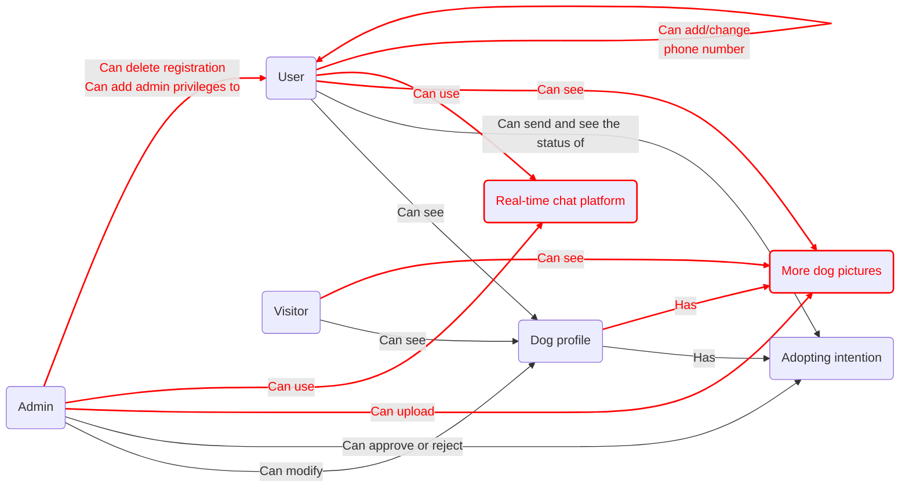
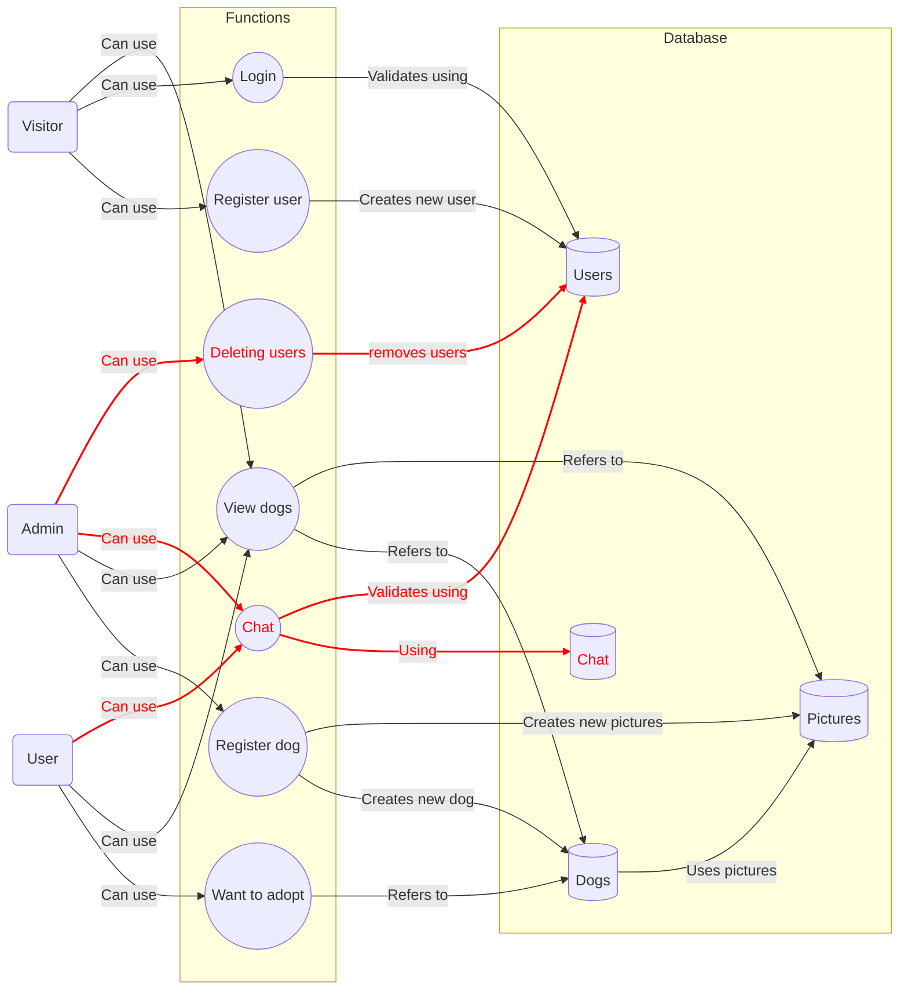
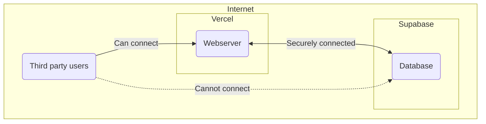
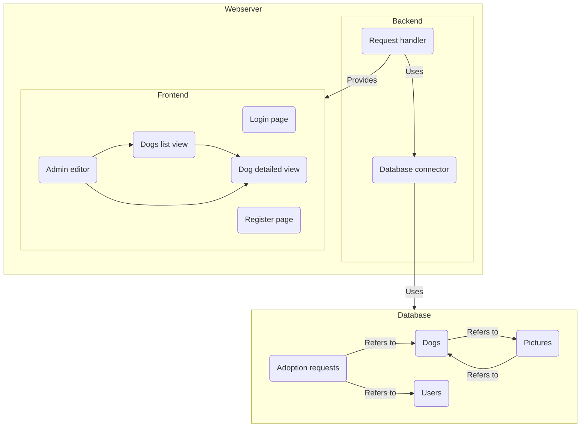
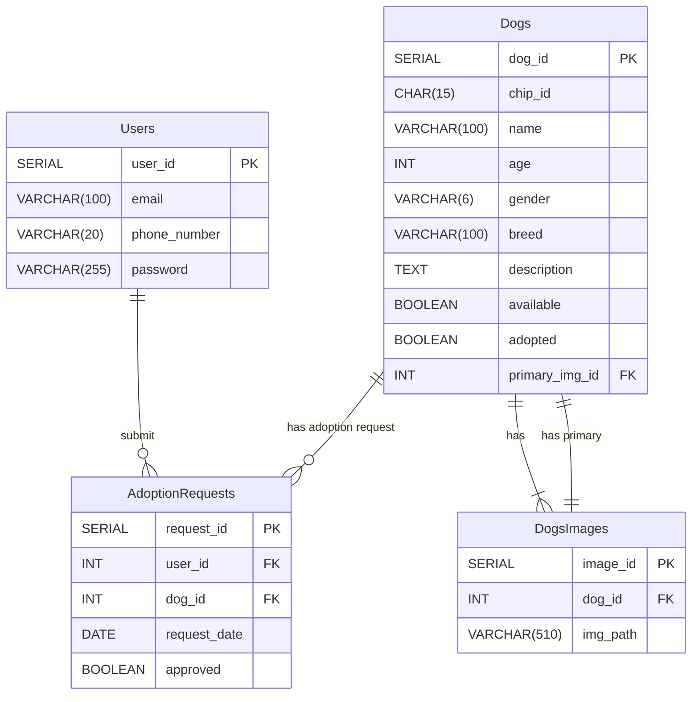
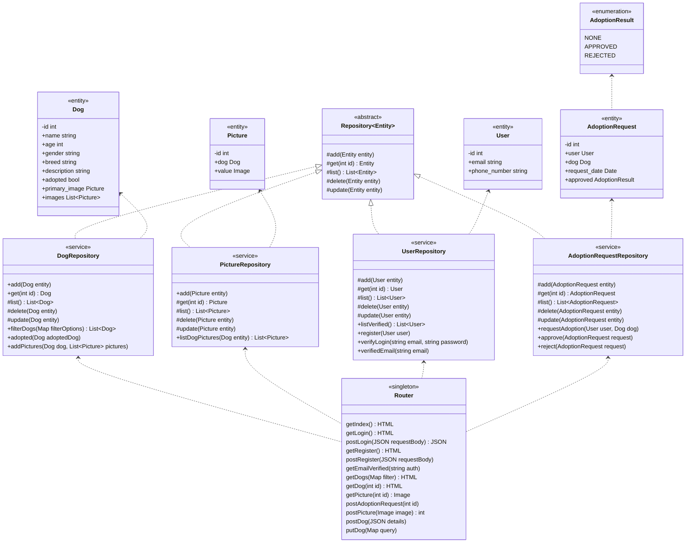
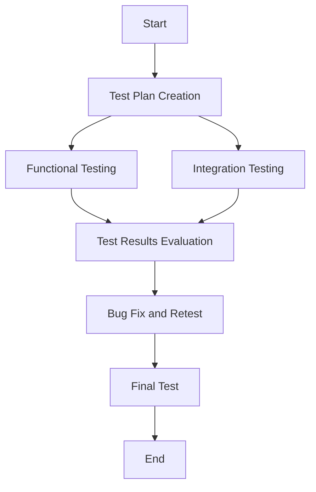

# Rendszerterv

---

## Tartalomjegyzék:

1. [A rendszer célja](#1-a-rendszer-célja)

2. [Projekt terv](#2-projekt-terv)

3. [Üzleti folyamatok modellje](#3-üzleti-folyamatok-modellje)

4. [Követelmények](#4-követelmények)

5. [Funkcionális terv](#5-funkcionális-terv)

6. [Fizikai környezet](#6-fizikai-környezet)

7. [Absztarkt domain modell](#7-absztrakt-domain-modell)

8. [Architekturális terv](#8-architekturális-terv)

9. [Adatbázis terv](#9-adatbázis-terv)

10. [Implementációs terv](#10-implementációs-terv)

11. [Tesztterv](#11-tesztterv)

12. [Telepítési terv](#12-telepítési-terv)

13. [Karbantartási terv](#13-karbantartási-terv)

---

## 1. A rendszer célja

### 1.1 Rendszer célja

A rendszer célja, hogy modern, felhasználóbarát webes felületet biztosítson egy menhely számára,
ahol a felhasználók könnyedén böngészhetik a kutyaprofilokat, részletes információkat találhatnak a kiválasztott
kutyákról, és jelezhetik örökbefogadási szándékukat egy adott kutya esetén. A rendszernek továbbá adminisztrátori
eszközöket kell kínálnia a központ munkatársai számára, hogy kezelhessék a kutyaprofilokat, a képfeltöltéseket, a
felhasználói fiókokat, valamint kommunikálhassanak a felhasználókkal az örökbefogadási folyamat során.

Az alapvető célkitűzések a következők:

1. **Felhasználói élmény javítása:** A rendszer reszponzív és felhasználóbarát felületen biztosítja a kutyák böngészését
   és az örökbefogadási folyamatot.
2. **Hatékony információkezelés:** Lehetővé teszi a kutyákról szóló információk és képek naprakész kezelését és
   megjelenítését.
3. **Örökbefogadási folyamat támogatása:** A felhasználók egyszerűen jelezhetik örökbefogadási szándékukat, kapcsolatba
   léphetnek az adminisztrátorokkal, és hozzáférhetnek a kutyákról szóló részletes leírásokhoz.
4. **Adminisztrációs funkcionalitások biztosítása:** Az adminisztrátorok jogosultak a felhasználói fiókok és
   kutyaprofilok kezelésére, valamint valós idejű kommunikációt folytathatnak az érdeklődőkkel a beépített chat funkció
   segítségével.
5. **Adatbiztonság és megfelelés:** A rendszer a GDPR előírásoknak megfelelően kezeli a felhasználói adatokat, különös
   tekintettel az örökbefogadási folyamat során gyűjtött érzékeny információkra.

### 1.2 Nemcélok

Az alábbiak nem tartoznak a rendszer célkitűzései közé, és nem képezik részét a fejlesztési követelményeknek:

1. **Örökbefogadási folyamat jogi kezelése:** A rendszer nem váltja ki az örökbefogadási szerződéseket, dokumentációkat
   és az örökbefogadási eljárás jogi aspektusait. Ezt a menhelynek a hagyományos módon kell kezelnie.

2. **Pénzügyi tranzakciók kezelése:** A rendszer nem támogat online fizetéseket, adománygyűjtést vagy bármilyen pénzügyi
   tranzakciót. Az anyagi támogatások vagy örökbefogadási díjak lebonyolítása offline vagy egyéb fizetési csatornákon
   keresztül történik.

3. **Automatizált döntéshozatal az örökbefogadásban:** A rendszer nem végzi el az örökbefogadási kérelmek jóváhagyását
   vagy elutasítását. Az adminisztrátorok feladata marad a döntéshozatal, a rendszer csak a kapcsolattartást és a
   profilok kezelését segíti.

4. **Egészségügyi vagy viselkedési elemzés biztosítása:** A rendszer nem ad tanácsot vagy elemzést a kutyák egészségi
   állapotáról, viselkedéséről vagy gondozásáról. Az ilyen jellegű kérdéseket az érdeklődőknek közvetlenül az
   menhely dolgozóvial kell megbeszélniük.

5. **Hirdetések és marketing funkciók támogatása:** A rendszer nem biztosít eszközöket reklámkampányokhoz, marketing
   tevékenységekhez, vagy a kutyák profiljainak külső hirdetési platformokon való megosztásához.

## 2. Projekt terv

### 2.1 Projekt munkások és felelősségeik

- **Projektvezető: Bagoly Luca**
    - Felelős a projekt egészéért, a határidők betartásáért, az erőforrások elosztásáért és a projekt előrehaladásának
      nyomon követéséért.
    - Biztosítja a kommunikációt a csapattagok között, valamint a megrendelővel való kapcsolattartást.

- **Fejlesztőcsapat vezető: File Tibor**
    - Felügyeli és koordinálja a fejlesztői csapat munkáját, biztosítja, hogy a technikai feladatok megfelelően legyenek
      végrehajtva.
    - A fejlesztési ütemterv betartásáért és a technikai kihívások megoldásáért felel.

- **Frontend fejlesztő: Bagoly Luca**
    - Felelős az alkalmazás felhasználói felületének fejlesztéséért, a reszponzív design megvalósításáért és a
      felhasználói élmény optimalizálásáért.

- **Backend fejlesztő: Bánvölgyi Bence**
    - A szerveroldali logika fejlesztéséért felelős, beleértve az adatbázisok kezelését, az API-k fejlesztését és az
      üzleti logika megvalósítását.

- **UI/UX tervező: Bagoly Luca**
    - Az alkalmazás vizuális megjelenéséért és felhasználói élményének kialakításáért felelős, biztosítva, hogy a
      rendszer intuitív és felhasználóbarát legyen.

- **Tesztelő: Bagoly Luca, File Tibor, Bánvölgyi Bence**
    - Felelős az alkalmazás hibamentességének ellenőrzéséért, különböző funkcionális és nem funkcionális tesztek
      végrehajtásáért, valamint a hibák dokumentálásáért és nyomon követéséért.

- **Rendszeradminisztrátor: File Tibor, Bánvölgyi Bence**
    - Felelős az alkalmazás hosztolásáért, a szerverek és adatbázisok üzemeltetéséért, valamint a biztonsági
      intézkedések alkalmazásáért.

### 2.2 Ütemterv

Az ütemterv a projekt különböző szakaszainak időbeli ütemezését mutatja. Az alábbiakban a főbb fázisok és a hozzájuk
rendelt időintervallumok láthatók:

- **1. Szakasz: Követelményspecifikáció és Funkcionális specifikáció meghatározása** – 1 hét _(2024. Okt. 14-20.)_
    - Cél: Az alkalmazás funkcionalitásának részletes meghatározása.

- **2. Szakasz: Rendszerterv elkészítése** – 1 hét _(2024. Okt. 28. - Nov. 3.)_
    - Cél: Az alkalmazás rendszertervének meghatározása.

- **3. Szakasz: Fejlesztés sprint I.** – 1 hét _(2024. Nov. 4-10.)_
    - Cél: A kutya képek feltöltésének funkciójának implementálása. A sprint elején tisztázandó a képfeltöltés technikai
      megoldása és a felhasználói felület integrálása.

- **4. Szakasz: Fejlesztés sprint II.** – 1 hét _(2024. Nov. 11-17.)_
    - Cél: A kutya profilképének kiválasztására szolgáló funkció hozzáadása, valamint a felhasználók adminisztrátori
      szintű kezelésének megvalósítása. A sprint elején tisztázandó a felhasználói jogosultságok kezelése és a profilkép
      kiválasztásának folyamata.

- **5. Szakasz: Fejlesztés sprint III., Projekt bemutató, Demo-val** – 1 hét _(2024. Nov. 18-24.)_
    - Cél: A projekt állapotának bemutatása, a már elkészült funkciók demonstrálása és a felhasználói visszajelzések
      begyűjtése. A sprint elején tisztázandó a demó prezentálásának menete és a várt visszajelzések.

- **6. Szakasz: Fejlesztés sprint IV., tesztelés** – 1 hét _(2024. Nov. 25. - Dec. 1.)_
    - Cél: A telefonszám szerkesztésének funkciója felhasználóként, valamint a már fejlesztett funkciók tesztelése,
      hibák keresése és javítása. A sprint elején tisztázandó a tesztelési eljárás és a prioritások.

- **7. Szakasz: Fejlesztés sprint V., tesztelés** - 1 hét  _(2024. Dec. 2-8.)_
    - Cél: A chat funkció implementálása, amely valószínűleg több hétig tart. A sprint elején tisztázandó a chat felület
      tervezése és a technikai megvalósítás részletei.

- **8. Szakasz: Felkézülés az átadásra/átvételre** - Átadás dátuma: 2024. december 9.
    - Cél: A projekt befejezése, a dokumentáció és a végső jelentés elkészítése, valamint az átadásra való felkészülés.
      A sprint elején tisztázandó az átadási folyamat és a szükséges dokumentumok.

### 2.3 **Mérföldkövek**

A projekt során a következő mérföldköveket határozzuk meg, amelyek fontos lépései a fejlesztésnek és a funkciók
implementálásának:

- **Mérföldkő 1: Követelményspecifikáció és Funkcionális specifikáció elkészítése** _(2024. Okt. 20.)_
    - Az alkalmazás funkcionalitásának részletes leírása és a követelmények dokumentálása.

- **Mérföldkő 2: Rendszerterv elkészítése** _(2024. Nov. 3.)_
    - A rendszer architektúrájának és tervezésének véglegesítése, amely alapot ad a fejlesztéshez.

- **Mérföldkő 3: Kutyák képeinek feltöltése funkció elkészítése** _(2024. Nov. 10.)_
    - A kutya képek feltöltési lehetőségének megvalósítása és integrálása a felhasználói felületbe.

- **Mérföldkő 4: Kutya profilkép kiválasztása és felhasználók adminisztrációs funkcióinak bevezetése** _(2024. Nov.
  17.)_
    - A kutyák profilképének kiválasztására szolgáló funkció, valamint a felhasználói fiókok adminisztrátori kezelésének
      implementálása.

- **Mérföldkő 5: Projekt bemutató és visszajelzés gyűjtése** _(2024. Nov. 24.)_
    - A projekt állapotának bemutatása a csapatnak és az érdekelteknek, valamint a felhasználói visszajelzések
      összegyűjtése.

- **Mérföldkő 6: Telefonszám szerkesztésének funkciójának bevezetése és tesztelés** _(2024. Dec. 1.)_
    - A telefonszám szerkesztési lehetőségének elkészítése és a már kifejlesztett funkciók tesztelése.

- **Mérföldkő 7: Chat funkció implementálása** _(2024. Dec. 8.)_
    - A chat funkció véglegesítése, tesztelése, és a felhasználói élmény javítása érdekében végzett finomhangolás.

- **Mérföldkő 8: Átadásra való felkészülés** _(2024. Dec. 9.)_
    - A projekt befejezése, a végső dokumentáció elkészítése és az átadási folyamat lebonyolítása.

## 3. Üzleti folyamatok modellje



Az új elemek pirossal vannak felölve a modellen.

### 3.1 Szerepkörök és Funkciók

1. **Adminisztrátor**:
    - **Kutya profil kezelése**: Profilok módosítása, képek feltöltése.
    - **Adoptálási kérelmek**: Kérelmek jóváhagyása vagy elutasítása.
    - **Kommunikáció**: Valós idejű kommunikáció a felhasználókkal.
    - **Felhasználó kezelés**: Fiókok törlése, admin jogosultságok kiosztása.

2. **Felhasználó**:
    - **Profilok megtekintése**: Kutyaprofilok és további képek elérhetők.
    - **Adoptálás**: Kérelem küldése és státusz nyomon követése.
    - **Kommunikáció**:Valós idejű kommunikáció az adminisztrátorral.
    - **Telefonszám**: Hozzárendelheti a profiljához a telefonszámát, módosíthatja azt.

3. **Látogató**:
    - **Profilok böngészése**: Kutya profilok és képek megtekintése.

### 3.2 Folyamatok

- **Profilok böngészése**: Minden felhasználói szerepkör hozzáférhet a kutya profilokhoz.
- **Adoptálási szándék**: Csak a regisztrált felhasználók nyújthatnak be kérelmeket.
- **Chat**: A chat az adminisztrátorok és regisztrált felhasználók közötti kommunikációt támogatja.

## 4. Követelmények

- Real time chat létrehozása felhasználók és adminok között
- Egyszerű drag and drop képfeltöltési lehetőség a kutyaprofilokra
- Több kép feltöltésének a lehetősége
- Admin felhasználók a fiók felületen képesek felhasználói fiókok törlésére
- A weboldal designjának áttervezése hogy a fent említett változtatásokat megjelenítse

## 5. Funkcionális terv



## 6. Fizikai környezet

- A webszerver Vercel rendszerein lesz futtatva felhőben
- Az adatbázis Supabase rendszerein lesz tárolva felhőben



## 7. Absztrakt domain modell

### 7.1. Modell diagramja



### 7.2. Modell részei

Request handler
: A beérkező HTTP és HTTPS kapcsolatokat szolgálja ki.

Database connector
: Az adatbázissal történő kommunikációért felelős.

Admin editor
: Kutyákat regisztrálhat és törölhet, illetve szerkesztheti is.

Dogs list view
: Az örökbefogadható kutyák listáját jeleníti meg, képes szűrésre.

Dog detailed view
: Egy kutya részletes leírását jeleníti meg, és regisztrált felhasználók
itt jelezhetik örökbefogadási kérésüket.

Login page
: Regisztrált felhasználók bejelentkezését szolgálja.

Register page
: Felhasználók regisztrálását szolgálja.

Users
: A regisztrált felhasználók adatait tárolja.

Dogs
: A kutyák adatait tárolja.

Pictures
: A kutyák képeit tárolja.

Adoption requests
: Az örökbefogadási kéréseket tárolja.

## 8. Architekturális terv

## 9. Adatbázis terv

### 9.1 Logikai Adatmodell



#### 9.1.1 Dogs (Kutyák) Tábla

| Oszlop neve    | Adattípus      | Tulajdonságok                                                                   | 
|----------------|----------------|---------------------------------------------------------------------------------|
| dog_id         | `SERIAL`       | `PRIMARY KEY`                                                                   |
| chip_id        | `CHAR(15)`     | `UNIQUE`, `NOT NULL`, egyedi, 15 számból álló chip szám.                        |
| name           | `VARCHAR(100)` | `NOT NULL`, a kutya neve.                                                       |
| age            | `INT`          | `NOT NULL`, a kutya kora.                                                       |
| gender         | `VARCHAR(6)`   | `CHECK (gender in ('Male','Female'))`, a kutya neme.                            |
| breed          | `VARCHAR(100)` | `NOT NULL`, a kutya fajtája.                                                    |
| description    | `TEXT`         | `NOT NULL`, a kutya leírása.                                                    |
| available      | `BOOLEAN`      | `DEFAULT TRUE`, elérhetőség (örökbefogadható-e).                                |
| adoted         | `BOOLEAN`      | `DEFAULT FALSE`, a kutya adobtált-e (archiválás céljából).                      |
| primary_img_id | `INT`          | `REFERENCES DogsImages(image_id)`, a kutya adatlapján megjelenő elsődleges kép. | 

#### 9.1.2 Users (Felhasználók) Tábla

| Oszlop neve  | Adattípus      | Tulajdonságok                                                    |
|--------------|----------------|------------------------------------------------------------------|
| user_id      | `SERIAL`       | `PRIMARY KEY`, egyedi felhasználói azonosító (automatikusan nő). |
| email        | `VARCHAR(100)` | `UNIQUE`, `NOT NULL`, felhasználó email címe.                    |
| phone_number | `VARCHAR(20)`  | Felhasználó telefonszáma.                                        |
| password     | `VARCHAR(255)` | `NOT NULL`, jelszó (hashelt formában).                           |

#### 9.1.3 AdoptionRequests (Örökbefogadási kérelmek) Tábla

| Oszlop neve  | Adattípus | Tulajdonságok                                                                    |
|--------------|-----------|----------------------------------------------------------------------------------|
| request_id   | `SERIAL`  | `PRIMARY KEY`, egyedi kérelem azonosító (automatikusan nő).                      |
| user_id      | `INT`     | `REFERENCES Users(user_id)`, a felhasználó, aki az örökbefogadást kezdeményezte. |
| dog_id       | `INT`     | `REFERENCES Dogs(dog_id)`, a lefoglalt kutya chip száma.                         | 
| request_date | `DATE`    | `NOT NULL`, kérelem elküldésének dátuma.                                         |
| approved     | `BOOLEAN` | `DEFAULT FALSE`, megadja, hogy a kérelem elfogadásra került-e.                   |

#### 9.1.4 DogsImages (Kutyák képei) Tábla

| Oszlop neve | Adattípus      | Tulajdonságok                                            |
|-------------|----------------|----------------------------------------------------------|
| image_id    | `SERIAL`       | `PRIMARY KEY`, egyedi kép azonosító (automatikusan nő).  |
| dog_id      | `INT`          | `REFERENCES Dogs(dog_id)`, a lefoglalt kutya chip száma. | 
| img_path    | `VARCHAR(510)` | A kutya adatlapján megjelenő kép.                        | 

#### 9.2 Fizikai Adatmodellt Legeneráló SQL Szkript

#### 9.2.1 Adatbázis létrehozása**

```sql
    CREATE DATABASE "LakatosBrendonDogShelterDB"
        WITH
        OWNER = admin
        ENCODING = 'UTF8'
        CONNECTION LIMIT = -1;
```

#### 9.2.2 Táblák létrehozása

**Dogs (Kutyák) Tábla**

```sql
    CREATE TABLE "Dogs"
    (
        dog_id serial NOT NULL,
        chip_id character(15) NOT NULL,
        name character varying(100) NOT NULL,
        age integer NOT NULL,
        gender character varying(6) NOT NULL,
        breed character varying(100) NOT NULL,
        description text NOT NULL,
        available boolean DEFAULT TRUE,
        adopted boolean DEFAULT FALSE,
        primary_img_id integer NOT NULL,
        CONSTRAINT "PK dog" PRIMARY KEY (dog_id),
        CONSTRAINT "chip_id unique" UNIQUE (chip_id),
        CONSTRAINT gender_check CHECK (gender in ('Male','Female')),
        CONSTRAINT "FK primary_img" FOREIGN_KEY (primary_img_id)
            REFERENCES "DogsImages" (image_id) 
    );    
```

**Users (Felhasználók) Tábla**

```sql
    CREATE TABLE "Users"
    (
        user_id serial NOT NULL,
        email character varying(100) NOT NULL,
        phone_number character varying(20),
        password character varying(255) NOT NULL,
        CONSTRAINT "PK user" PRIMARY KEY (user_id),
        CONSTRAINT email_unique UNIQUE (email)
    );
```

**AdoptionRequests (Örökbefogadási kérelmek) Tábla**

```sql
    CREATE TABLE "AdoptionRequests"
    (
        request_id serial NOT NULL,
        user_id integer NOT NULL,
        dog_id integer NOT NULL,
        request_date date NOT NULL,
        approved boolean DEFAULT false,
        CONSTRAINT "PK request" PRIMARY KEY (request_id),
        CONSTRAINT "FK dog" FOREIGN KEY (dog_id)
            REFERENCES "Dogs" (dog_id),
        CONSTRAINT "FK user" FOREIGN KEY (user_id)
            REFERENCES "Users" (user_id)
    );
```

**DogsImages (Kutyák képei) Tábla**

```sql
    CREATE TABLE "DogsImages"
    (
        image_id serial NOT NULL,
        dog_id integer NOT NULL,
        img_path character varying(510),
        CONSTRAINT "PK image" PRIMARY KEY (image_id),
        CONSTRAINT "FK dog" FOREIGN KEY (dog_id)
            REFERENCES "Dogs" (dog_id)
    );
```

## 10. Implementációs terv



## 11. Tesztterv



### 11.1 Fő Tesztesetek

Íme néhány főbb teszteset a menhelyes webalkalmazáshoz, amelyek a rendszer kulcsfontosságú funkcióit fedik le:

1. Regisztráció és Bejelentkezés
    - **Tesztcél:** Ellenőrizni, hogy a felhasználók megfelelően tudnak regisztrálni és bejelentkezni.
        - **Elvárás:** Sikeres regisztráció esetén a rendszer új felhasználót hoz létre, bejelentkezés után a
          felhasználó eléri a saját profilját.
        - **Negatív eset:** Sikertelen regisztráció hiányzó vagy hibás adatok esetén; a rendszer figyelmeztető üzenetet
          jelenít meg.

2. Kutya profiljainak megtekintése
    - **Tesztcél:** Biztosítani, hogy minden felhasználó (beleértve a látogatókat is) böngészhesse a kutya profilokat.
        - **Elvárás:** A kutyák adatai (név, kor, leírás, képek) helyesen jelennek meg, és az oldal reszponzív.

3. Keresés és szűrés kutya profilok között
    - **Tesztcél:** Ellenőrizni, hogy a felhasználók szűrhetik a kutya profilokat kor, nem és fajta alapján.
        - **Elvárás:** A keresési feltételeknek megfelelő kutyák jelennek meg.

4. Adoptálási kérelem benyújtása
    - **Tesztcél:** Biztosítani, hogy a regisztrált felhasználók sikeresen benyújthatnak adoptálási kérelmet.
        - **Elvárás:** Kérelem benyújtása után a rendszer megjeleníti a kérelem státuszát.

5. Adminisztrátor kutya profil kezelés
    - **Tesztcél:** Ellenőrizni, hogy az adminisztrátor módosíthatja a kutyák profilját (pl. képek feltöltése,
      elsődleges kép beállítása).
        - **Elvárás:** A változtatások a kutya profilján azonnal megjelennek a felhasználók számára.

6. Felhasználó telefonszámának szerkesztése
    - **Tesztcél:** Ellenőrizni, hogy a felhasználók szerkeszthetik a profiljukhoz tartozó telefonszámot.
        - **Elvárás:** A módosított telefonszám mentése után a profilban az új szám jelenik meg.

7. Chat funkció működése
    - **Tesztcél:** Biztosítani, hogy a chat felület megfelelően működik adminisztrátorok és felhasználók között.
        - **Elvárás:** A felhasználók és adminisztrátorok közötti üzenetek azonnal megjelennek mindkét fél számára.

8. Felhasználói fiók törlése adminisztrátorként
    - **Tesztcél:** Ellenőrizni, hogy az adminisztrátor törölheti a felhasználói fiókokat.
        - **Elvárás:** A törölt felhasználó nem tud bejelentkezni, és adatai eltűnnek a rendszerből.

9. Adminisztrátor jogosultság hozzáadása más felhasználóknak
    - **Tesztcél:** Biztosítani, hogy az adminisztrátor további felhasználóknak adminisztrátori jogosultságot tud adni.
        - **Elvárás:** A kiválasztott felhasználók adminisztrátori jogosultságokat kapnak, és hozzáférnek az admin
          funkciókhoz.

## 12. Telepítési terv

## 13. Karbantartási terv
