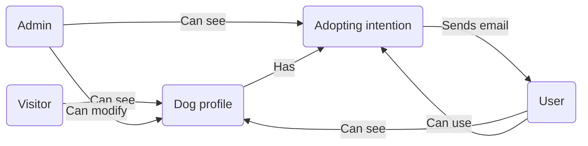
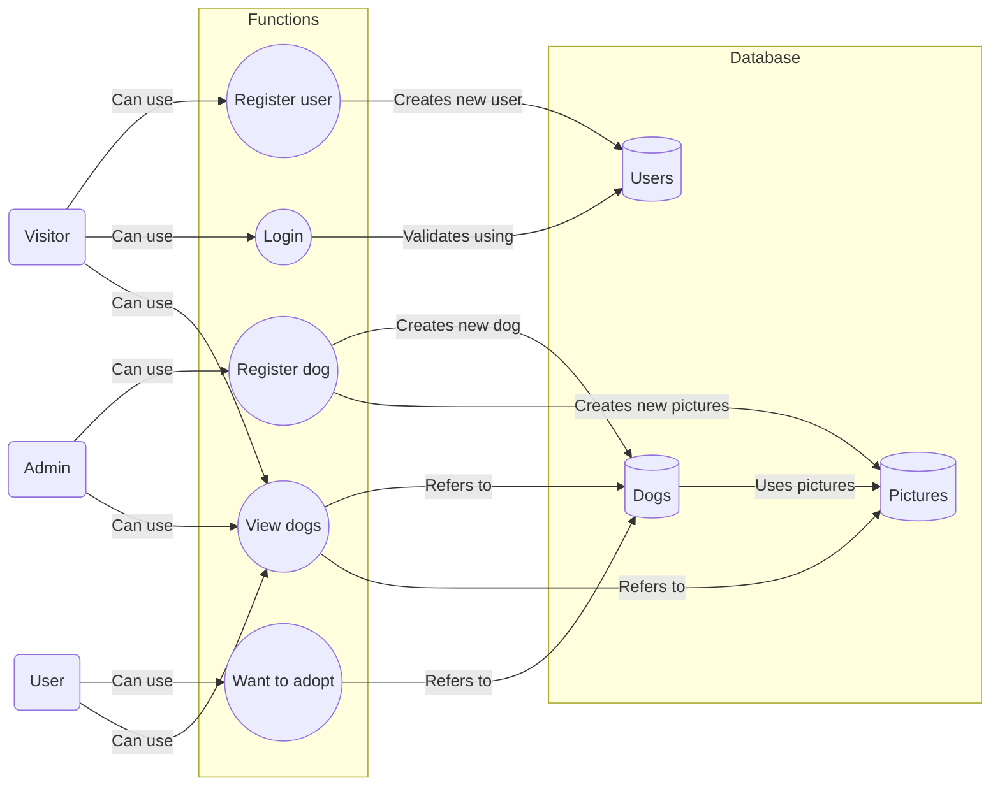
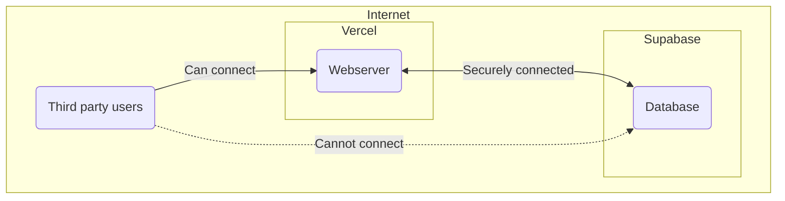
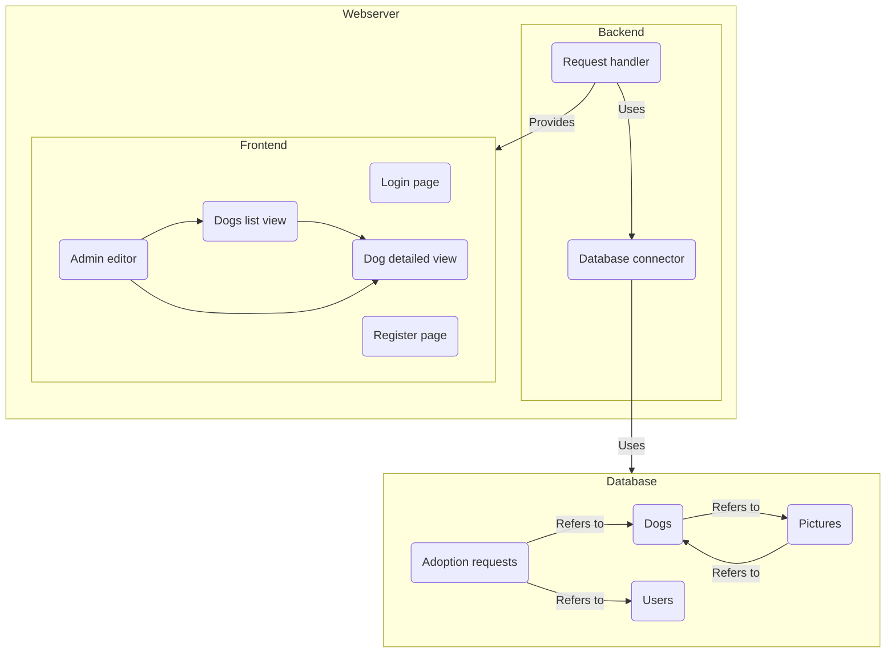
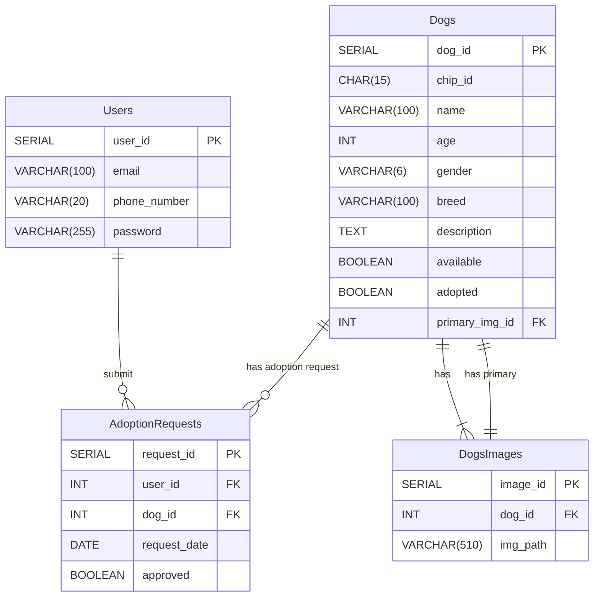
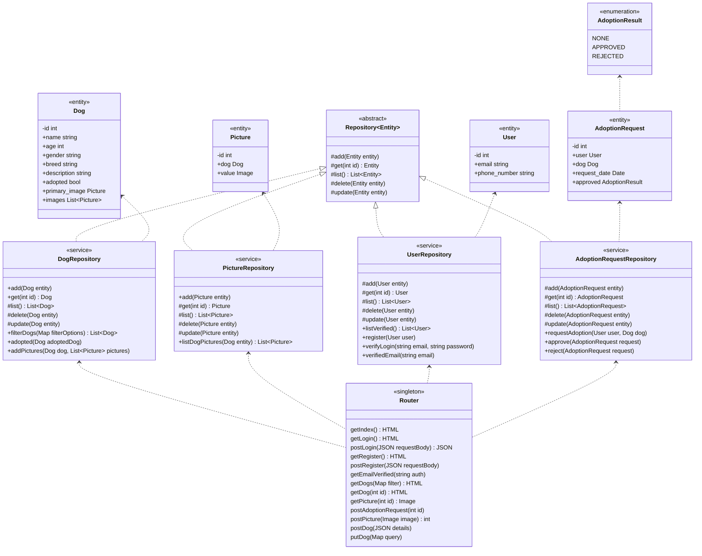
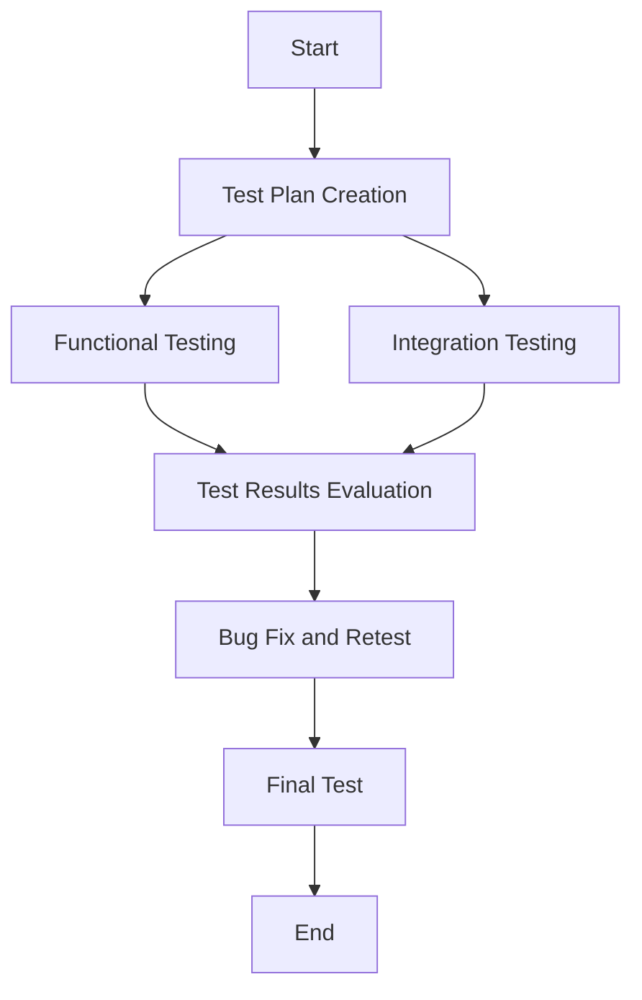

# Rendszerterv

---

## Tartalomjegyzék:

1. [A rendszer célja](#1-a-rendszer-célja)

2. [Projekt terv](#2-projekt-terv)

3. [Üzleti folyamatok modellje](#3-üzleti-folyamatok-modellje)

4. [Követelmények](#4-követelmények)

5. [Funkcionális terv](#5-funkcionális-terv)

6. [Fizikai környezet](#6-fizikai-környezet)

7. [Absztarkt domain modell](#7-absztarkt-domain-modell)

8. [Architekturális terv](#8-architekturális-terv)

9. [Adatbázis terv](#9-adatbázis-terv)

10. [Implementációs terv](#10-implementációs-terv)

11. [Tesztterv](#11-tesztterv)

12. [Telepítési terv](#12-telepítési-terv)

13. [Karbantartási terv](#13-karbantartási-terv)

---

## 1. A rendszer célja

A rendszer célja, hogy egy webalapú alkalmazást biztosítson a menhely számára, amely hatékonyan kezeli és prezentálja az
örökbefogadható kutyák adatait a potenciális gazdiknak. A rendszer lehetővé teszi a felhasználók számára, hogy
böngésszenek a kutyák között, megismerjék azok alapvető jellemzőit – mint például név, kor, nem –, és online
lefoglalhassák őket örökbefogadásra. Az adminisztrátorok, a menhely dolgozói, hozzáadhatják, szerkeszthetik a kutyák
adatait, és feldolgozhatják az örökbefogadási kérelmeket.

Nem célja a rendszernek, a kutyák állapotának vagy egészségügyi adatainak részletes orvosi nyilvántartása. Az orvosi
adatok
kezelése nem képezi részét az alkalmazás funkcionalitásának.
Nem célja, hogy pénzügyi tranzakciókat vagy adománygyűjtést bonyolítson le a felhasználók és a menhely között. A
rendszer nem tartalmaz online fizetési rendszert vagy adományozási modult.
A rendszer nem biztosít logisztikai szolgáltatásokat, például a kutyák szállításának megszervezését. Az örökbefogadás
folyamata kizárólag a menhely és az örökbefogadó között zajlik.

## 2. Projekt terv

### 2.1 Projekt munkások és felelősségeik

- **Projektvezető: Bagoly Luca**
    - Felelős a projekt egészéért, a határidők betartásáért, az erőforrások elosztásáért és a projekt előrehaladásának
      nyomon követéséért.
    - Biztosítja a kommunikációt a csapattagok között, valamint a megrendelővel való kapcsolattartást.

- **Fejlesztőcsapat vezető: File Tibor**
    - Felügyeli és koordinálja a fejlesztői csapat munkáját, biztosítja, hogy a technikai feladatok megfelelően legyenek
      végrehajtva.
    - A fejlesztési ütemterv betartásáért és a technikai kihívások megoldásáért felel.

- **Frontend fejlesztő: Bagoly Luca**
    - Felelős az alkalmazás felhasználói felületének fejlesztéséért, a reszponzív design megvalósításáért és a
      felhasználói élmény optimalizálásáért.

- **Backend fejlesztő: Bánvölgyi Bence**
    - A szerveroldali logika fejlesztéséért felelős, beleértve az adatbázisok kezelését, az API-k fejlesztését és az
      üzleti logika megvalósítását.

- **UI/UX tervező: Bagoly Luca**
    - Az alkalmazás vizuális megjelenéséért és felhasználói élményének kialakításáért felelős, biztosítva, hogy a
      rendszer intuitív és felhasználóbarát legyen.

- **Tesztelő: Bagoly Luca, File Tibor, Bánvölgyi Bence**
    - Felelős az alkalmazás hibamentességének ellenőrzéséért, különböző funkcionális és nem funkcionális tesztek
      végrehajtásáért, valamint a hibák dokumentálásáért és nyomon követéséért.

- **Rendszeradminisztrátor: File Tibor, Bánvölgyi Bence**
    - Felelős az alkalmazás hosztolásáért, a szerverek és adatbázisok üzemeltetéséért, valamint a biztonsági
      intézkedések alkalmazásáért.

### 2.2 Ütemterv

Az ütemterv a projekt különböző szakaszainak időbeli ütemezését mutatja. Az alábbiakban a főbb fázisok és a hozzájuk
rendelt időintervallumok láthatók:

- **1. Szakasz: Követelményspecifikáció és Funkcionális specifikáció meghatározása** – 2 hét
    - Cél: Az alkalmazás funkcionalitásának részletes meghatározása.

- **2. Szakasz: Rendszerterv elkészítése** – 1 hét
    - Cél: Az alkalmazás rendszertervének meghatározása.

- **3. Szakasz: Fejlesztés/Tesztelés** – 1 hét
    - Cél: Frontend és backend fejlesztés, adatbázis kialakítása. A rendszer hibamentességének ellenőrzése, funkcionális
      és nem funkcionális tesztek.

### 2.3 **Mérföldkövek**

A mérföldkövek olyan fontos szakaszok, amelyeket a projekt során el kell érni:

- **Követelményspecifikáció és funkcionális specifikáció elkészítése** – 1. hét vége
- **Backend API és adatbázis kész** – 3. hét vége
- **Frontend alapfunkciók elkészülése** – 3. hét vége
- **Tesztelés megkezdése** – 3. hét eleje
- **Hibajavítások lezárása** – 3. hét vége

## 3. Üzleti folyamatok modellje

- A látogatók böngészhetnek az elérhető kutyák között, és megtekinthetik a részletes profilokat, amelyek olyan információkat tartalmaznak, mint a fajta, kor, méret, temperamentum és képek.
- A felhasználók különböző kritériumok (pl. fajta, típus, életkor) alapján szűrhetik a kutyákat, és további részletekért felfedezhetik az egyes kutyák profilját. Minden egyes kutya profilján egy gomb segítségével a látogatók kifejezhetik érdeklődésüket a kutya örökbefogadása iránt.
- A menhelyi dolgozó szemszögéből nézve a kutyamenhely honlapja intuitív háttérrendszert biztosít a kutyaprofilok kezeléséhez és az örökbefogadási érdeklődés nyomon követéséhez. A menhely munkatársai egy felhasználóbarát adminisztrációs felületen keresztül könnyen hozzáadhatnak, szerkeszthetnek vagy eltávolíthatnak kutyaprofilokat, frissítve az olyan adatokat, mint a fajta, kor, méret, temperamentum és fényképek. A háttértár rendszerezi és tárolja az összes beérkezett anyagot, így a menhely dolgozói nyomon követhetik az érdeklődés szintjét, és hatékonyan követhetik a potenciális örökbefogadókkal való kapcsolattartást. Ez a rendszer minimalizálja az adminisztratív terheket, és zökkenőmentes kommunikációt biztosít a menhely és a nyilvánosság között.

## 4. Követelmények

### 4.1. Funkcionális követelmények

- A kutyák örökbefogadási állapota a weboldalon szabadon elérhető
- Kutyák rövid leírásának listája
- Adott kutya részletes leírása
- Keresés szűrése: kor, fajta és nem alapján
- Bármennyi általános felhasználó regisztrálása
- Regisztrált felhasználók belépése
- Regisztrált felhasználók jelezhetik az örökbefogadási igényüket
- Automatikus e-mail értesítés eltusításkor
- Automatikus e-mail verification regisztráláskor
- Egyetlen admin jogosultsággal rendelkező fiók
- Admin felhasználó feltölthet új kutyákat a weboldalon
- Admin felhasználó láthatja az örökbefogadási kérvényeket egy bizonyos kutyához
- Az örökbefogadott kutyák törlése az oldalról az admin fiókon keresztül

### 4.2. Nem funkcionális követelmények

- A belépés csak egy sessionig tart, így nem szeretnénk cookie-kat tárolni
- Regisztrált felhasználók nem jelezhetik az örökbefogadási kérésüket már örökbefogadott kutyákhoz

## 5. Funkcionális terv



## 6. Fizikai környezet

- A webszerver Vercel rendszerein lesz futtatva felhőben
- Az adatbázis Supabase rendszerein lesz tárolva felhőben



## 7. Absztrakt domain modell

### 7.1. Modell diagramja



### 7.2. Modell részei

Request handler
: A beérkező HTTP és HTTPS kapcsolatokat szolgálja ki.

Database connector
: Az adatbázissal történő kommunikációért felelős.

Admin editor
: Kutyákat regisztrálhat és törölhet, illetve szerkesztheti is.

Dogs list view
: Az örökbefogadható kutyák listáját jeleníti meg, képes szűrésre.

Dog detailed view
: Egy kutya részletes leírását jeleníti meg, és regisztrált felhasználók
itt jelezhetik örökbefogadási kérésüket.

Login page
: Regisztrált felhasználók bejelentkezését szolgálja.

Register page
: Felhasználók regisztrálását szolgálja.

Users
: A regisztrált felhasználók adatait tárolja.

Dogs
: A kutyák adatait tárolja.

Pictures
: A kutyák képeit tárolja.

Adoption requests
: Az örökbefogadási kéréseket tárolja.

## 8. Architekturális terv

A webszerver frontend részén újrahasználható komponensek segítségével fog
felépülni a különböző weboldalak.

A webszerver backendje ORM segítségével az adatbázisban szereplő sorokat
kódban könnyen kezelhető entitásokká alakítja, és proxyk segítségével
kezeli is azokat. A backend felelős még a beérkező HTTP kapcsolatok
kezeléésért is, az authentikációért és a jogosultságok kezeléséért is.

## 9. Adatbázis terv

### 9.1 Logikai Adatmodell



#### 9.1.1 Dogs (Kutyák) Tábla

| Oszlop neve    | Adattípus      | Tulajdonságok                                                                   | 
|----------------|----------------|---------------------------------------------------------------------------------|
| dog_id         | `SERIAL`       | `PRIMARY KEY`                                                                   |
| chip_id        | `CHAR(15)`     | `UNIQUE`, `NOT NULL`, egyedi, 15 számból álló chip szám.                        |
| name           | `VARCHAR(100)` | `NOT NULL`, a kutya neve.                                                       |
| age            | `INT`          | `NOT NULL`, a kutya kora.                                                       |
| gender         | `VARCHAR(6)`   | `CHECK (gender in ('Male','Female'))`, a kutya neme.                            |
| breed          | `VARCHAR(100)` | `NOT NULL`, a kutya fajtája.                                                    |
| description    | `TEXT`         | `NOT NULL`, a kutya leírása.                                                    |
| available      | `BOOLEAN`      | `DEFAULT TRUE`, elérhetőség (örökbefogadható-e).                                |
| adoted         | `BOOLEAN`      | `DEFAULT FALSE`, a kutya adobtált-e (archiválás céljából).                      |
| primary_img_id | `INT`          | `REFERENCES DogsImages(image_id)`, a kutya adatlapján megjelenő elsődleges kép. | 

#### 9.1.2 Users (Felhasználók) Tábla

| Oszlop neve  | Adattípus      | Tulajdonságok                                                    |
|--------------|----------------|------------------------------------------------------------------|
| user_id      | `SERIAL`       | `PRIMARY KEY`, egyedi felhasználói azonosító (automatikusan nő). |
| email        | `VARCHAR(100)` | `UNIQUE`, `NOT NULL`, felhasználó email címe.                    |
| phone_number | `VARCHAR(20)`  | Felhasználó telefonszáma.                                        |
| password     | `VARCHAR(255)` | `NOT NULL`, jelszó (hashelt formában).                           |

#### 9.1.3 AdoptionRequests (Örökbefogadási kérelmek) Tábla

| Oszlop neve  | Adattípus | Tulajdonságok                                                                    |
|--------------|-----------|----------------------------------------------------------------------------------|
| request_id   | `SERIAL`  | `PRIMARY KEY`, egyedi kérelem azonosító (automatikusan nő).                      |
| user_id      | `INT`     | `REFERENCES Users(user_id)`, a felhasználó, aki az örökbefogadást kezdeményezte. |
| dog_id       | `INT`     | `REFERENCES Dogs(dog_id)`, a lefoglalt kutya chip száma.                         | 
| request_date | `DATE`    | `NOT NULL`, kérelem elküldésének dátuma.                                         |
| approved     | `BOOLEAN` | `DEFAULT FALSE`, megadja, hogy a kérelem elfogadásra került-e.                   |

#### 9.1.4 DogsImages (Kutyák képei) Tábla

| Oszlop neve | Adattípus      | Tulajdonságok                                            |
|-------------|----------------|----------------------------------------------------------|
| image_id    | `SERIAL`       | `PRIMARY KEY`, egyedi kép azonosító (automatikusan nő).  |
| dog_id      | `INT`          | `REFERENCES Dogs(dog_id)`, a lefoglalt kutya chip száma. | 
| img_path    | `VARCHAR(510)` | A kutya adatlapján megjelenő kép.                        | 

#### 9.2 Tárolt Eljárások

#### 9.3 Fizikai Adatmodellt Legeneráló SQL Szkript

#### 9.3.1 Adatbázis létrehozása**

```sql
    CREATE DATABASE "LakatosBrendonDogShelterDB"
        WITH
        OWNER = admin
        ENCODING = 'UTF8'
        CONNECTION LIMIT = -1;
```

#### 9.3.2 Táblák létrehozása

**Dogs (Kutyák) Tábla**

```sql
    CREATE TABLE "Dogs"
    (
        dog_id serial NOT NULL,
        chip_id character(15) NOT NULL,
        name character varying(100) NOT NULL,
        age integer NOT NULL,
        gender character varying(6) NOT NULL,
        breed character varying(100) NOT NULL,
        description text NOT NULL,
        available boolean DEFAULT TRUE,
        adopted boolean DEFAULT FALSE,
        primary_img_id integer NOT NULL,
        CONSTRAINT "PK dog" PRIMARY KEY (dog_id),
        CONSTRAINT "chip_id unique" UNIQUE (chip_id),
        CONSTRAINT gender_check CHECK (gender in ('Male','Female')),
        CONSTRAINT "FK primary_img" FOREIGN_KEY (primary_img_id)
            REFERENCES "DogsImages" (image_id) 
    );    
```

**Users (Felhasználók) Tábla**

```sql
    CREATE TABLE "Users"
    (
        user_id serial NOT NULL,
        email character varying(100) NOT NULL,
        phone_number character varying(20),
        password character varying(255) NOT NULL,
        CONSTRAINT "PK user" PRIMARY KEY (user_id),
        CONSTRAINT email_unique UNIQUE (email)
    );
```

**AdoptionRequests (Örökbefogadási kérelmek) Tábla**

```sql
    CREATE TABLE "AdoptionRequests"
    (
        request_id serial NOT NULL,
        user_id integer NOT NULL,
        dog_id integer NOT NULL,
        request_date date NOT NULL,
        approved boolean DEFAULT false,
        CONSTRAINT "PK request" PRIMARY KEY (request_id),
        CONSTRAINT "FK dog" FOREIGN KEY (dog_id)
            REFERENCES "Dogs" (dog_id),
        CONSTRAINT "FK user" FOREIGN KEY (user_id)
            REFERENCES "Users" (user_id)
    );
```

**DogsImages (Kutyák képei) Tábla**

```sql
    CREATE TABLE "DogsImages"
    (
        image_id serial NOT NULL,
        dog_id integer NOT NULL,
        img_path character varying(510),
        CONSTRAINT "PK image" PRIMARY KEY (image_id),
        CONSTRAINT "FK dog" FOREIGN KEY (dog_id)
            REFERENCES "Dogs" (dog_id)
    );
```

## 10. Implementációs terv



## 11. Tesztterv



### 11.1 Fő Tesztesetek

- **Felhasználó regisztrációja és bejelentkezése:** Regisztráció, bejelentkezés különböző felhasználókkal (felhasználó
  szerepkörrel).
- **Kutyák böngészése:** Különböző kritériumok alapján történő kutyakeresés (pl. név, kor, fajta).
- **Kutyák hozzáadása, szerkesztése (admin):** Kutyák adatainak adminisztrátori felületen való hozzáadása, szerkesztése.
- **Örökbefogadási kérelmek:** Örökbefogadási kérelem leadása, státusz módosítása, törlése. Automatikus e-mail
  kiküldésének ellenőrzése.
- **Adatbázis integráció:** Ellenőrizzük, hogy a felhasználói és kutyaadatok megfelelően tárolódnak és frissülnek az
  adatbázisban.
- **Biztonsági teszt:** Hibás belépési próbálkozások kezelése, jelszóvédelem, érzékeny adatok titkosítása.

## 12. Telepítési terv

A teljes projekt felhőalapú lesz, a webszerver Vercelen, az adatbázis pedig a Supabase-en installáljuk. 
Először is szükségünk van egy Vercel fiókra, ahová a forráskódot fogjuk feltölteni. A Vercel automatikusan
elkészíti és telepíti a webkiszolgálót, amikor a változtatásokat a feltöltjük. Szükség van egy Supabase fiókra is,
amely a PostgreSQL adatbázist, a hitelesítést és a tárolási szolgáltatásokat fogja kezelni. A Supabase biztosít egy API
URL-t és egy nyilvános API-kulcsot, amelyet a forráskódba kell integrálni, így lehetővé téve a kommunikációt az
adatbázissal. Ezeket a hitelesítő adatokat biztonságosan hozzá kell adni a Vercelhez környezeti változóként a Vercel
kezelőfelületén keresztül. A webalkalmazás a Supabase klienst fogja használni az adatbázissal való összes interakció
kezelésére, beleértve a hitelesítést, az adatlekérdezést és a tárolást. Semmi másra nincs szükség, mivel a Vercel kezeli
a tárhelyet, a frontendet és a backendet, míg a Supabase kezeli az adatbázist.

## 13. Karbantartási terv

A rendszer karbantartási terve kizárólag a meglévő funkciók hibajavításaira összpontosít, biztosítva az alkalmazás
stabilitását és teljesítményét. A Supabase adatbázis frissítéseit vagy konfigurációit szükség szerint karbantartják a
hibák megoldása érdekében, biztosítva, hogy a backend-szolgáltatások ne szenvedjenek fennakadást. E terv keretében nem
kerül sor új funkciók fejlesztésére vagy bevezetésére; az új funkciók vagy nagyobb frissítések iránti kérelmek külön
projektet igényelnek, amelyhez külön projektet kell indítani, saját hatáskörrel, költségvetéssel és fejlesztési
ütemtervvel.